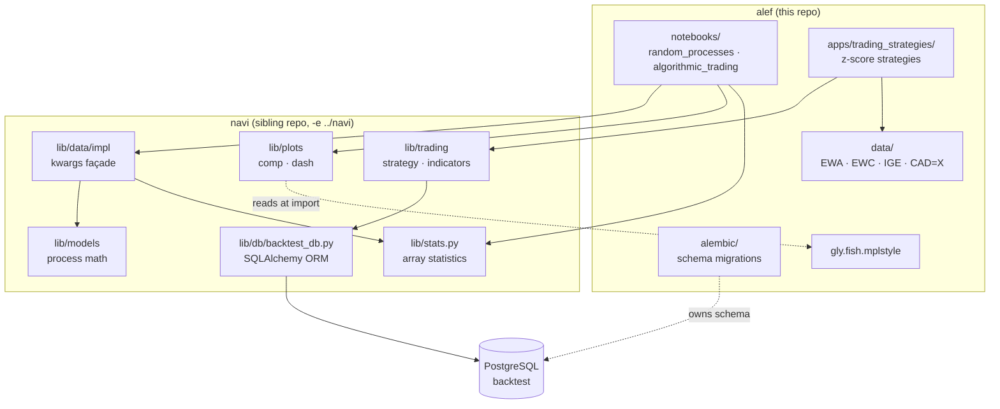
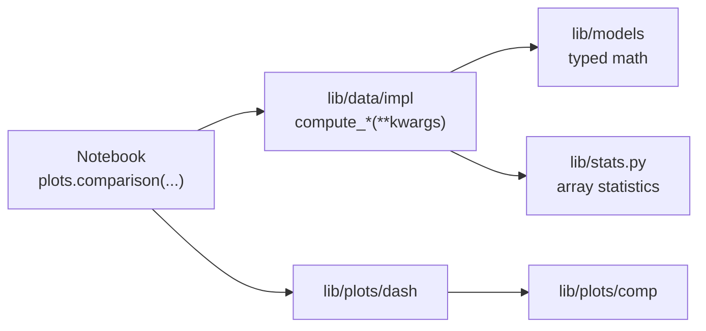
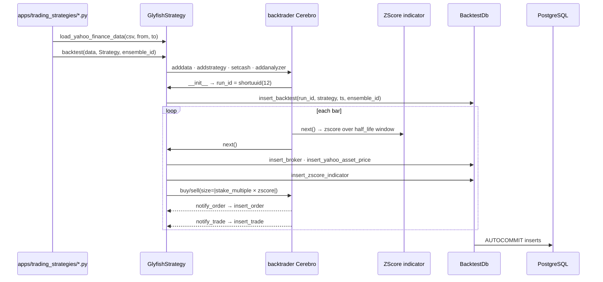

# Architecture

How **alef** and **navi** fit together: alef is the research workspace that grew
the library, navi is the library that was extracted out of it.

---

## 1. System context

**alef** is a notebook workspace and a set of runnable backtests. **navi** is the
numerical library it stands on: stochastic process models, statistical
estimation, hypothesis tests, plotting, and backtest persistence.

alef depends on navi. navi does not import alef — with one runtime exception
worth knowing about (§9).



Note the split ownership around the database: navi defines the ORM classes and
does all the writing, but **alef owns the schema** via its alembic migrations.
That division is the source of the drift catalogued in §10.

---

## 2. How this repo produced the library

navi did not start as a library. It was `alef/lib/`, and the extraction is
visible in alef's history:

| Commit | |
|---|---|
| `bd292b7` | preping for removing lib |
| `4e2897f` | moved lib to navi |
| `128e80f` | update requirments |
| `6aa12ec` | fix module errors with navi |
| `9a81752` | fixed import errors |
| `3e99ae3` | fixed pylance errors |

The goal was a reusable module that could be **edited in place and shared across
sibling projects** — not a published package. That is why it is an editable
install rather than a versioned release, and why the package kept the name `lib`
(§9). A monorepo would be the more conventional way to get the same property,
and would likely have been the choice had it been on the table at the time; the
current layout reaches the same end through `pip install -e`.

This matters for reading the code. The library's shape was driven by what
notebooks needed at the keyboard — hence the `**kwargs` convention (§4), the
figure-per-call plotting API (§6), and the Greek-letter parameter names (`μ`,
`λ`, `Δt`, `σ`, `Φ`, `β`) that match the papers being reproduced rather than any
Python style guide. It was designed for a REPL, then promoted.

### Where navi's tests live

**navi carries no test suite of its own. Tests for navi live in the repo that
consumes the code under test.** This is a deliberate convention, and it is the
single most important thing to know before adding tests to any of these repos:

| navi module | Tested in | Status |
|---|---|---|
| `lib/clients/`, `lib/mcp_client.py` | **meida** (`tests/`) | in place — 59 tests, `httpx.MockTransport`, no network |
| `lib/models/`, `lib/data/`, `lib/stats.py`, `lib/plots/` | **alef** | planned; today covered by notebooks |
| `lib/trading/`, `lib/db/` | alef, moving with the bots | strategies expected to move to their own project |

The rule follows from what navi is: a shared, editable module rather than a
published package (§2 above). Each consumer owns the domain it exercises, so
tests sit next to the work that motivates them and the fixtures they need.

Do not add a `tests/` directory to navi. If you are testing navi's analysis
code, it belongs in **alef** — that is the right home for it, and running
`pytest` from the alef root imports `lib` correctly with no path setup, exactly
as meida's suite already does.

Until that suite exists, correctness is demonstrated by notebooks that simulate
a process with known parameters, estimate those parameters back, and plot the
comparison. `zscore_indicator_verification.ipynb` is the clearest example — it
exists purely to confirm navi's backtrader indicator agrees with the vectorized
implementation. Those notebooks are the specification the eventual tests should
encode.

---

## 3. Repository layout

### alef

| Path | Role |
|---|---|
| `notebooks/random_processes/` | ARIMA, Brownian/fractional Brownian motion, OU, VAR, VECM, ECM |
| `notebooks/algorithmic_trading/` | Cointegration analysis, backtrader strategy verification |
| `apps/trading_strategies/` | Runnable long / short / long-short z-score backtests |
| `apps/back_trader_examples/` | Vanilla backtrader getting-started scripts |
| `apps/output/` | CSV written by strategy runs |
| `data/algorithmic_trading/` | Yahoo-format price CSVs |
| `alembic/versions/` | Backtest schema — **source of truth for the DDL** |
| *(plot style)* | Ships inside navi as `lib/gly.fish.mplstyle` — see §9 |
| `console.py` | Cell-delimited scratch buffer, not an entry point |

### navi

| Path | Role |
|---|---|
| `lib/models/` | Process math: `bm`, `fbm`, `ou`, `arima`, `var`, `vecm`, `ecm`, `adf` |
| `lib/data/impl/` | `**kwargs` façade over `lib/models`, one module per process |
| `lib/data/param_est.py` | `ParamEst` and per-model estimate containers |
| `lib/data/hyp_test.py` | Test-type enums, statistics, pass/fail semantics |
| `lib/data/reports.py` | `tabulate`-formatted text reports |
| `lib/stats.py` | Array statistics — no time axis, no kwargs |
| `lib/plots/comp/` | Draws onto a caller-supplied axis |
| `lib/plots/dash/` | Owns the figure; wraps `comp` |
| `lib/trading/` | `GlyfishStrategy` base, `ZScore` indicator, metrics |
| `lib/db/backtest_db.py` | ORM + insert/fetch for backtest results |
| `lib/utils.py` | kwargs helpers, ensemble/scan drivers, CSV readers |
| `lib/clients/`, `lib/mcp_client.py` | Data-provider clients — used by *meida*, not alef |

navi is installed as an editable local package (`-e ../navi` in
`requirements.in`), so `import lib.data` resolves live from the sibling
checkout. `pyrightconfig.json` mirrors this with `extraPaths: ["../navi"]`.

---

## 4. The numerical stack

Three layers, each with a distinct calling convention. This is the core of the
library and the part most worth understanding before extending it.



**`lib/models/` — explicit, typed, positional.** Pure functions with named
parameters and full docstrings. `ou.mean(μ, λ, t, x0)` takes exactly what the
formula takes. No kwargs, no defaults beyond the mathematically natural ones.
This is where the mathematics lives, and it reads like the source papers.

**`lib/data/impl/` — the notebook-facing façade.** Every function is
`compute_*(**kwargs)` and returns a `(t, values)` tuple. It unpacks kwargs,
applies defaults, and delegates to `lib/models`. The uniform signature is what
makes the ensemble drivers in §5 possible.

```python
# lib/data/impl/bm.py
def compute_sd(**kwargs) -> tuple[NDArray, NDArray]:
    npts = get_param_default_if_missing("npts", 10, **kwargs)
    σ    = get_param_default_if_missing("σ", 1.0, **kwargs)
    Δt   = get_param_default_if_missing("Δt", 1.0, **kwargs)
    t = Δt * create_space(xmin=1, npts=npts)
    return t, σ*numpy.sqrt(t)
```

The trade-off is deliberate and worth stating plainly: the façade gives up
static checking and IDE completion in exchange for a signature that composes.
Required parameters are enforced at runtime by `get_param_throw_if_missing`;
everything else defaults. **The docstring is the only parameter contract** —
there is no schema, so a misspelled kwarg is silently ignored rather than
rejected. That is the single sharpest edge in the library.

### Two modules named `stats`

Both exist, they are different, and notebooks import the second one:

| | `lib.stats` | `lib.data.stats` (`lib/data/impl/stats.py`) |
|---|---|---|
| Signature | `acf(samples, nlags)` | `compute_acf(time, data, **kwargs)` |
| Returns | array | `(time, array)` tuple |
| Knows about time | no | yes |

`from lib.data import stats` gets the second. The first is the leaf it delegates
to. When adding a statistic, add it to `lib.stats` first, then wrap it.

---

## 5. Ensembles and parameter scans

Because every `compute_*` shares one signature, `lib/utils.py` can drive them
generically. These four functions are how the notebooks do Monte Carlo work:

| Function | Purpose |
|---|---|
| `create_ensemble(source, nsim, **kwargs)` | Run one source `nsim` times → `(t, [samples])` |
| `create_parameter_scan(source, *args)` | Run once per kwargs dict → `([t], [samples])` |
| `apply_to_ensemble(func, t, ensemble, **kwargs)` | Map a statistic across realizations |
| `apply_to_parameter_scan(func, t, scan, **kwargs)` | Same, across a scan |

A typical notebook composes them end to end:

```python
t, ensemble = create_ensemble(fbm.create, nsim=100, npts=1000, H=0.7)
t, mean     = apply_to_ensemble(stats.compute_ensemble_mean, t, ensemble)
comparison([mean, fbm.compute_mean(npts=1000)[1]], t, ...)
```

The uniform `(t, values)` return is what lets simulation output feed a statistic
feed a plot without adapters. Everything in the numerical stack is arranged to
keep that pipeline unbroken.

---

## 6. Plot architecture

`lib/plots` splits on one question: **who owns the figure?**

| | `lib/plots/comp/` | `lib/plots/dash/` |
|---|---|---|
| Signature | `curve(axis, y, x, **kwargs)` | `curve(y, x, **kwargs)` |
| Figure | caller's | creates via `pyplot.subplots` |
| Saving | never | honors `file_name` |
| Use | composing multi-panel layouts | one call, one figure |

`dash` is a thin wrapper — create figure, delegate to `comp`, save if asked:

```python
def curve(y, x=None, **kwargs):
    figsize   = get_param_default_if_missing("figsize", (10,6), **kwargs)
    file_name = get_param_default_if_missing("file_name", None, **kwargs)
    fig, axis = pyplot.subplots(figsize=figsize)
    comp.curve(axis, y, x, **kwargs)
    if file_name is not None:
        fig.savefig(file_name)
        pyplot.close(fig)
```

`lib/plots/__init__.py` re-exports the `dash` names flat, so notebooks write
`from lib.plots import comparison, fcurve`. The `comp` layer is what you reach
for when building a dashboard — `plots/dash/backtrader.py` (the largest plotting
module, ~1000 lines) is built entirely from `comp` primitives.

`PlotType` (`LINEAR`, `LOG`, `XLOG`, `YLOG`) selects axis scaling and carries
matching tick/spine styling in `plots/comp/axis.py`.

---

## 7. The backtest pipeline

`GlyfishStrategy` is a `bt.Strategy` subclass that adds identity and persistence
to every run. Concrete strategies inherit it and call `super().next()`.



Two identifiers structure the results. **`run_id`** (a 12-char shortuuid) is one
backtest. **`ensemble_id`** groups runs that belong to one experiment — it is
generated at *module scope* in each strategy script, so a single `python
long_short_zscore_strategy.py` invocation produces one run under one ensemble.
The column exists to let a parameter sweep tag many runs as one study.

Strategy logic itself is deliberately thin. `LongShortZScore.next()` is a
position-state machine over the sign of the z-score: no position → open long or
short; existing position → exit on sign flip, or resize by the delta between
desired and held size. The z-score scales the stake rather than merely gating
entry, following Chan's Example 2.8.

### The indicator, twice

`ZScore` implements both `next()` (bar-by-bar) and `once()` (vectorized
batch) — backtrader calls whichever fits its run mode. They must agree, and
nothing enforces that. `notebooks/algorithmic_trading/backtrader/zscore_indicator_verification.ipynb`
is the check, and it is the reason that notebook exists.

---

## 8. Persistence

`BacktestDb` wraps a SQLAlchemy engine at `postgresql://backtrader@localhost/backtest`,
opened with `isolation_level="AUTOCOMMIT"` — every insert is its own
transaction, so a crashed backtest leaves its partial history intact for
inspection. That is the right call for research and the wrong one for anything
transactional.

| Table | Grain | Written by |
|---|---|---|
| `backtests` | one row per run | `insert_backtest` at `__init__` |
| `broker` | run × date | `insert_broker` each bar |
| `asset_prices` | run × date | `insert_yahoo_asset_price` each bar |
| `positions` | run × date | `insert_position` when held |
| `orders` | run × date × status | `notify_order` |
| `trades` | run × date | `notify_trade` |
| `indicators` | run × date | `insert_zscore_indicator` |
| `analyzers` | run × date | `__insert_analyzer` (private, currently unused) |
| `price_series` | ticker × date | `insert_yahoo_price_series` |

`indicators.value` and `.params` are `JSONB`, which is what keeps the schema
stable across indicators — the z-score writes `{'zscore': v}` and
`{'period': p, 'stake_multiple': m}` into the same columns any future indicator
would use. Queries reach in with `params->'period'`.

`price_series` is the one table not scoped to a run: it is a shared cache of
price history, keyed by ticker and date.

> **`insert_price_series` does not work against a migrated schema.** It writes an
> `open_interest` column that the ORM declares but the migration never creates,
> so the insert fails. `insert_yahoo_price_series` calls it, so that path is
> affected too. See §10 for this and four other ORM/migration mismatches.

The `fetch_*` methods return pandas DataFrames and are the read path for the
`plots/dash/backtrader.py` dashboards.

---

## 9. Configuration and environment

| Concern | Mechanism |
|---|---|
| Python | 3.11.2 via pyenv (`.python-version`, virtualenv `alef-3.11.2`) |
| Dependencies | `requirements.in` → pip-compiled `requirements.txt` |
| navi resolution | editable install `-e ../navi`; pyright `extraPaths` |
| `PYTHONPATH` | `.env` prepends the alef root; VSCode loads it via `python.envFile` |
| DB URL | **hardcoded** in `BacktestDb.__init__`, duplicated in `alembic.ini` |
| API keys | `navi/.env` via `lib/env.py` — unused by alef |

### Plot style sheets and display targets

Figures are rendered for **two different display targets**, and they need
different typography. Both sheets ship inside the navi package, and `config.py`
resolves them against the package rather than the working directory:

| Sheet | Accessor | Target |
|---|---|---|
| `lib/gly.fish.mplstyle` | `config.glyfish_style` | notebooks, interactive display |
| `lib/gly.fish-web.mplstyle` | `config.glyfish_web_style` | PNGs embedded in web pages |

```python
from lib import config
pyplot.style.use(config.glyfish_style)      # alef, meida notebooks
pyplot.style.use(config.glyfish_web_style)  # yada's plot agents
```

The two differ **only in font sizes** — web is 15/13/12 against the notebook
14/12/10. Everything else, including the full colour cycle, grid, and spine
treatment, is shared. The reason is that a notebook figure can be zoomed, while
a PNG embedded at a fixed width cannot, so its text must be larger to stay
legible. yada writes ~148 such images into `yada/html/plots/`.

Add a target by adding a sheet and an accessor, not by forking the base: the
palette should stay common so a colour change propagates everywhere.
`pyproject.toml` carries `[tool.setuptools.package-data]` (`lib = ["*.mplstyle"]`)
so non-editable installs include both files.

`config.save_post_asset(figure, post, plot)` writes a figure to
`<cwd>/plots/<post>/<plot>.png` — the publishing path for post assets. It is
cwd-relative by design, so a notebook writes alongside the post it belongs to.

#### Why it used to be otherwise

Until recently `config.py` searched for a style file by walking up from
`os.getcwd()`, up to 45 levels, raising `FileNotFoundError` at **import time** if
it found nothing. navi shipped no copy; each repo supplied its own and the walk
found the nearest one above the working directory.

That made the choice of display target **implicit** — you got whichever sheet
happened to sit above your working directory. It also made import success depend
on where the process started: `import lib` failed outright from navi's own repo
root, since no style file exists at or above `navi/`.

The per-repo differences that accumulated under that scheme were not drift.
yada's larger fonts were a deliberate adaptation to web rendering, and reading
them as rot is an easy mistake — the current arrangement names the targets so
the distinction is visible in the code rather than inferred from directory
position.

Copies remain in pymc, alpaca, and MCMC. Those are abandoned tutorial projects
that predate navi and do not depend on it — pymc and alpaca carry their own
`lib/config.py`. Ignore them.

### The package is named `lib`, not `navi`

The distribution is `navi`, but the package it installs is `lib` —
`navi.egg-info/top_level.txt` contains exactly one entry. So
`pip install -e ../navi` is what makes `from lib.data import fbm` work, and
imports resolve identically from any working directory:

```
lib.__file__ -> /Users/troy/Develop/gly.fish/navi/lib/__init__.py
```

This is deliberate. Keeping the package name `lib` meant the extraction changed
**no import statement in any of the 37 notebooks** — the move became a packaging
change rather than a rewrite. navi is not intended for publication; it is a
shared, live-editable module for sibling projects, so the usual reasons to
rename it after the distribution do not apply. Nothing imports the name `navi`.

All 37 notebooks open by prepending the alef root to `sys.path`:

```python
sys.path.insert(0, os.path.abspath('../../..'))
```

This dates from when the library was `alef/lib/` and imports resolved through
that path. Since the extraction they resolve through the editable install
instead, so the line no longer participates in finding `lib` — the notebooks run
correctly with or without it.

The `%autoreload 2` above it does still earn its place. Combined with the
editable install, edits to navi land in a running kernel without a restart,
which is what made alef a practical harness for developing the library it was
extracting.

---

## 10. Known inconsistencies

Verified against the code; listed so they are not rediscovered.

**ORM/migration drift.** The ORM in `lib/db/backtest_db.py` and the DDL in
`alembic/versions/659095aec2e8_*.py` were edited independently and no longer
agree. The migration is what actually exists in the database.

| Item | ORM | Migration | Effect |
|---|---|---|---|
| `price_series.open_interest` | column, `nullable=False` | **absent** | `insert_price_series` writes it → **fails** on a migrated schema |
| `analyzers` JSONB column | `parameters` | `params` | latent; nothing writes it today |
| `broker.time_stamp`, `.strategy` | columns | absent | latent; `insert_broker` sets neither |
| `backtests` primary key | `run_id` + `strategy` | `run_id` | ORM is stricter than reality |
| `positions.updt` | `Date` | `Float` | type mismatch |

`insert_price_series` is the only one that breaks under use. Reconciling the ORM
to the migration — or generating the migration from the ORM, which is the real
fix — would close all five.

**Layering violation.** `lib/models/` is meant to be the leaf, and six of its
eight modules are. Two are not:

- `models/adf.py` imports `lib.data.reports.ADFTestReport`
- `models/fbm.py` imports `lib.data.reports` and `lib.data.hyp_test`

Both are the modules that return *test results* rather than simulations, so they
reach up for the report types. It works — `lib.data.reports` imports only
`lib.data.hyp_test`, so no cycle closes — but `lib.data.__init__` → `impl.adf` →
`models.adf` → `lib.data.reports` re-enters a partially initialized package, and
it survives only because that path touches no attribute defined in
`lib/data/__init__.py`. Pushing the report types down into a layer both can
depend on would make it safe.

**Coordinate drift in the DB layer.** `insert_backtest` records `strategy` but
`insert_broker` does not, so joining broker rows to a strategy name requires
going through `backtests`.

**Naming.** `apps/trading_strategies/long_zscore_strtegy.py` and
`short_zscore_strtegy.py` are both misspelled; the long-short one is not.

---

## 11. Extending

**A new stochastic process** — follow `ou` or `bm` end to end:

1. `lib/models/x.py` — the mathematics, typed and positional, numpy-docstringed.
2. `lib/data/impl/x.py` — `compute_*(**kwargs) -> (t, values)` wrappers. Document
   every kwarg; the docstring is the contract.
3. Register in `lib/data/__init__.py`.
4. If it needs a hypothesis test, add the enum member to `HypothesisTestType`
   *and* its branch in both `status()` and `desc()` — they are parallel
   if-chains and neither has an exhaustiveness check.
5. Reports go in `lib/data/reports.py`, not in `models/`.
6. Add a notebook under `alef/notebooks/random_processes/x/` that simulates with
   known parameters and estimates them back. **That notebook is the test.**

**A new plot** — implement in `lib/plots/comp/` against a passed axis, wrap in
`lib/plots/dash/`, export from both `__init__.py` files.

**A new strategy** — subclass `GlyfishStrategy`, call `super().__init__(ensemble_id)`
and `super().next()`, declare `params`, and persist anything custom through
`BacktestDb`. Schema changes are an alembic migration in **alef**, and the ORM
in navi must be updated to match (see §10).

---

## 12. Runtime

```bash
pyenv activate alef-3.11.2
pip install -r requirements.txt          # includes -e ../navi

alembic upgrade head                     # create/update backtest schema
jupyter lab                              # notebooks
python apps/trading_strategies/long_short_zscore_strategy.py
```

Strategy runs need PostgreSQL reachable at `postgresql://backtrader@localhost/backtest`;
`BacktestDb` connects in `GlyfishStrategy.__init__`, so a missing database fails
the run immediately rather than at the first write. Notebooks need no database —
only `gly.fish.mplstyle` findable from the working directory (§9).
