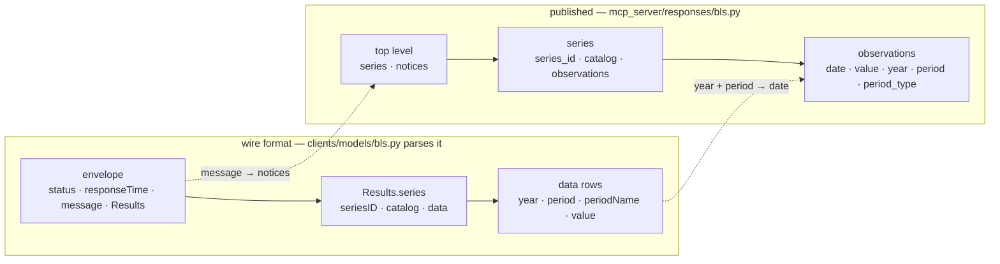

# BLS Reference — API and metadata files

Reference for the U.S. Bureau of Labor Statistics (BLS) integration: the Public
Data **API** (observations, exposed as MCP tools) and the **flat-file** pipeline
that builds the series-metadata catalog. Built and in use — `BlsClient` and its
models in `clients/`, five MCP tools behind three published response models, and
the metadata export in `notebooks/bls/utils.py`.

## Two data paths (important)

BLS data comes from two different places, by design:

| | Source | Used for |
| --- | --- | --- |
| **Metadata catalog** | flat files at `download.bls.gov` | the searchable series catalog (survey + series YAML) |
| **Observations** | the Public Data **API** (`api.bls.gov`) | the actual year/period/value points, fetched on demand |

The API **cannot enumerate series** (only 25 "popular" per survey) and exposes
neither coverage dates nor index bases — so the catalog is built from the flat
files, and the API is used only to fetch observations for a series once you've
found it. The API reference is below; the flat-file source and the metadata
files it produces are documented after it.

The API sections' source: BLS Developers docs — API Signatures v2, v1, and
FAQ/Getting Started pages (last modified Oct 5, 2020), retrieved via the Wayback
Machine (bls.gov blocks automated requests).

- [BLS Developers home](https://www.bls.gov/developers/home.htm)
- [API Signatures v2](https://www.bls.gov/developers/api_signature_v2.htm)
- [API Signatures v1](https://www.bls.gov/developers/api_signature.htm)
- [API FAQs](https://www.bls.gov/developers/api_faqs.htm)

## Basics

- **Two versions, same paths, different base URL:**
  - v2 → `https://api.bls.gov/publicAPI/v2`
  - v1 → `https://api.bls.gov/publicAPI/v1`
- **v2 requires a free registration key**; v1 is open but limited. The key goes
  in the **request body** (`registrationkey`) for POST, or as a **query param**
  (`?registrationkey=`) for GET.
- **`GET` is used only for single-series reads; `POST` (JSON body,
  `Content-Type: application/json`) for everything multi-series or parameterized.**
- **Series ID rules:** may contain `_`, `-`, `#`; no lowercase letters or other
  special characters. Years are 4-digit `YYYY`.
- ⚠️ **Errors come back as HTTP 200** with `"status":"REQUEST_NOT_PROCESSED"`
  and details in the `message[]` array (bad syntax, exceeded limits, etc.).
  `400`/`500` are true HTTP errors. A client must check the `status` field, not
  just the HTTP status code.
- **Output formats:** JSON, or Excel by appending `.xlsx` to the data path.

## Limits (registered v2 vs unregistered v1)

| | v2 (Registered) | v1 (Unregistered) |
| --- | --- | --- |
| Daily queries | 500 | 25 |
| Series per query | 50 | 25 |
| Years per query | 20 | 10 |
| Net/Percent-change calculations | ✅ | ❌ |
| Series description (catalog) | ✅ | ❌ |

## Endpoints (v2)

### 1. Single Series

`GET /timeseries/data/{seriesID}`
Returns the last 3 years for one series. No key needed for the basic call.
Excel: append `.xlsx` to the path.

### 2. Multiple Series

`POST /timeseries/data/`
JSON body: `{"seriesid":["id1", …, "idN"]}` (up to 50). Defaults to last 3
years. Add `"registrationkey"` for v2 limits.

### 3. One or More Series with Optional Parameters

`POST /timeseries/data/` — the full-featured call. JSON body fields:

| Field | Type | Notes |
| --- | --- | --- |
| `seriesid` | array | required |
| `startyear` / `endyear` | `"YYYY"` | up to a 20-year span |
| `catalog` | bool | include series metadata (title, survey, seasonality, area, occupation…) |
| `calculations` | bool | net & percent changes over 1/3/6/12-period spans |
| `annualaverage` | bool | include annual-average data points |
| `aspects` | bool | extra aspects (e.g. Relative Standard Error) |
| `registrationkey` | string | required to use any of the above optional params |

Optional params default to `false`.

### 4. Latest Series Data

`GET /timeseries/data/{seriesID}?latest=true`
Just the single most-recent datapoint for a series.

### 5. Popular Series

`GET /timeseries/popular`
The 25 most-popular series IDs overall; optional `?survey=XX` narrows to one
survey (e.g. `LA` = Local Area Unemployment). Returns only series IDs.

### 6. All Surveys

`GET /surveys`
Catalog of every BLS survey: `survey_abbreviation` + `survey_name`.

### 7. Single Survey

`GET /surveys/{abbreviation}`
Metadata for one survey (e.g. `TU`): name, plus `allowsNetChange`,
`allowsPercentChange`, `hasAnnualAverages` flags.

## v1 Endpoints

v1 (`/publicAPI/v1/...`, no key, lower limits, no `catalog`/`calculations`)
offers only:

- **Single Series** — `GET /timeseries/data/{seriesID}`
- **Multiple Series** — `POST /timeseries/data/` with `{"seriesid":[...]}`
- **One or More Series, Specifying Years** — `POST` with `startyear`/`endyear`

## Response shape (all data endpoints)

```json
{
  "status": "REQUEST_SUCCEEDED",
  "responseTime": 37,
  "message": [],
  "Results": { "series": [
    { "seriesID": "LAUCN040010000000005",
      "catalog": { "series_title": "...", "survey_name": "...", "...": "..." },  // if catalog=true
      "data": [
        { "year": "2013", "period": "M11", "periodName": "November",
          "value": "16393", "latest": "true",                             // latest flag on most-recent
          "footnotes": [ { "code": "P", "text": "Preliminary." } ],
          "calculations": { "net_changes": {}, "pct_changes": {} },       // if calculations=true
          "aspects": [ ] }                                                // if aspects=true
      ]
    }
  ] }
}
```

Notes:

- `value` is a **string**; `year` too.
- `period` is coded: `M01`–`M12` monthly (`M13` = annual avg on some series),
  `Q01`–`Q04` quarterly, `A01` annual, `S01`/`S02` semiannual. `periodName` is
  the human label.
- `calculations.net_changes` / `pct_changes` are keyed by period-span offsets
  (e.g. `"1"`, `"3"`, `"6"`, `"12"`).
- The docs' single/multiple examples render `Results` as an **array**, but the
  live API returns it as an **object** with a `series` array. Pin this down
  against a real response when building the client.

## The API integration (built)

`BlsClient` (`clients/bls.py`) wraps the API above: POST for multi-series, GET
for surveys/popular/latest, optional key in body/query, and status-field error
checking (raises whenever `status != "REQUEST_SUCCEEDED"` despite HTTP 200, with
bounded retry/backoff on transient 5xx/transport errors and no retry on a 4xx or
a `REQUEST_NOT_PROCESSED`, which repeating cannot fix). The client and its models
are **meida's** — they sat in `navi/lib/clients` until it was clear meida was
their only consumer; they still import navi's `lib.env` and `lib.logger`. Five
MCP tools in `mcp_server/server.py` expose it: `bls_series_data`,
`bls_series_latest`, `bls_popular_series`, `bls_all_surveys`, `bls_survey_info`.
Config in navi's `lib/env.py`: `get_bls_api_key()` (`BLS_API_KEY`, optional) and
`get_bls_base_url()`.

### What the tools publish

The models in `clients/models/bls.py` mirror the wire format — they have to, to
parse it. They are **not** what the tools return. `mcp_server/responses/bls.py`
holds meida's own layer, and each BLS tool declares one of its models as its
return annotation, which is what FastMCP turns into the tool's `outputSchema`.

BLS is the source with the most to strip. The envelope is HTTP-shaped, the
observations sit three levels down, and the vendor spellings are pydantic
aliases, which a published schema emits verbatim — so passing the parsing models
through would make `{status, responseTime, message, Results}` and `seriesID`
this server's contract:



| Wire | Published |
| --- | --- |
| `Results.series[]` | `series[]` (lifted to the top level) |
| `seriesID` | `series_id` |
| `Series.data[]` | `Series.observations[]` |
| `periodName` | `period_name` |
| `latest: "true"` | `latest: true` — a real boolean, absent means `false` |
| `allowsNetChange`, `allowsPercentChange`, `hasAnnualAverages` | `allows_net_change`, `allows_percent_change`, `has_annual_averages` — parsed from BLS's `"true"`/`"false"` strings to real booleans, `null` when unreported |
| `message[]` | `notices[]` — **kept**, see below |
| `status`, `responseTime` | dropped |

Three decisions worth knowing:

- **An ISO `date` is derived from `year` + `period`**, and both are kept beside
  it. Every code BLS publishes maps to the **first day of the period it names**:
  `M01`–`M12` → `YYYY-MM-01`, `Q01`–`Q04` → January/April/July/October,
  `S01`/`S02` → January/July, `A01` → January. An unrecognised code gives
  `date: null` and `period_type: "unknown"` — never a guessed date, and never a
  dropped row. The annual-average codes (`M13`, `Q05`, `S03`) deliberately share
  a date with the first period of their year, so a series fetched with
  `annualaverage=true` holds two rows dated `YYYY-01-01`; **`period_type` is
  what tells them apart**, and what to filter on to keep aggregates out of a
  monthly or quarterly series.
- **`message[]` survives as `notices[]`.** It looks like transport and is not:
  on a `REQUEST_SUCCEEDED` response it is the *only* signal that a result was
  truncated ("Year range has been reduced to the system-allowed limit of 20
  years") or partly unfulfilled (a series id that does not exist). Dropping it
  would make the tools silently lossy, so it is published as data.
- **The optional nested payloads are carried through, not flattened away** —
  `catalog`, `calculations`, annual-average rows and `aspects`. The catalog's
  key set varies per survey (a CPI series is described by item and area, a CPS
  series by demographics), so the keys common to every survey are declared and
  the survey-specific remainder is kept verbatim in `catalog.additional_fields`.
  The empty `{}` objects BLS pads `footnotes` with are dropped.

| Tool | Model | Top-level fields |
| --- | --- | --- |
| `bls_series_data`, `bls_series_latest`, `bls_popular_series` | `BlsSeriesData` | `series`, `notices` |
| `bls_all_surveys` | `BlsSurveyList` | `surveys`, `notices` |
| `bls_survey_info` | `BlsSurveyInfo` | `survey`, `notices` |

`bls_survey_info` has its own model rather than reusing the list: BLS returns
both through the same envelope, but a lookup by abbreviation answers with one
survey (unwrapped from the one-element list, `null` when nothing matched) and is
the only call that populates the capability flags. `bls_popular_series` shares
`BlsSeriesData` with the data tools but returns series ids and no observations —
it is a discovery list.

Mappers (`from_bls_series_response`, `from_bls_surveys_response`,
`from_bls_survey_response`) are pure and total: no I/O, and a `None` or empty
payload maps to an empty model rather than raising at the tool boundary. Tests:
`tests/test_responses_bls.py`.

Both shapes are visible side by side in the notebooks: `notebooks/bls/client.ipynb`
drives `BlsClient` directly (the parsing models), while `mcp.ipynb` and
`walkthrough.ipynb` go through the server (the published models).

---

## Metadata source — the flat-file catalog

The searchable series catalog is built from the BLS **flat files**, not the API.

- **Location:** `https://download.bls.gov/pub/time.series/<survey>/`
- **Per survey:** `<survey>.series` (the series catalog), lookup tables
  (`<survey>.item`, `.area`, `.occupation`, …), and `<survey>.data.*` (the
  observations — **not** downloaded; observations come from the API).
- **Top level:** `overview.txt` maps each 2-char survey code to its name.

**Access gotcha — use `curl_cffi`, not plain httpx/curl.** `download.bls.gov`
rejects non-browser TLS fingerprints with a 403 "Access Denied" page — the same
page it serves when rate-limiting, so a 403 is ambiguous. The fetcher
(`fetch_bls_source_files`) uses `curl_cffi` impersonating Chrome to pass the
filter, with jittered gaps and 404-skip. **Be gentle** (spread large pulls out);
aggressive bulk access trips a multi-day block on the scripted path while a real
browser still works.

**Scope — 22 core surveys + an OE slice.** The full corpus is ~78M series;
injury/illness, retired programs, and the giant occupation×geography
cross-products are excluded, leaving 22 economic surveys (~271k series). The
`OE` (Occupational Employment & Wage Statistics) survey is added as a filtered
**national / all-industries** slice (`areatype=N & industry=000000`, ~16.5k
series) — occupation employment + wages, the elite-overproduction data — rather
than its full 6M cross-product.

---

## The survey metadata files

The export produces one metadata catalog under `notebooks/bls/data/`
(git-ignored, regenerable). It follows FRED's category/series model, with
**survey** standing in for category:

```text
notebooks/bls/data/
├── survey.yaml              # all survey definitions (the "category" list)
└── bls_series_<CODE>.yaml   # one per survey; series metadata, references survey
```

These are **metadata only** — no observed values. They exist so a document store
(yada) can build one searchable document per series; observations are fetched
separately from the API.

### `survey.yaml`

One entry per survey — the parent that series records reference by 2-char code:

```yaml
generated: '2026-07-25'
source: https://download.bls.gov/pub/time.series/
survey_count: 23
surveys:
  - code: LN
    name: Labor Force Statistics from the Current Population Survey (NAICS)
    series_file: bls_series_LN.yaml
    series_count: 68630
    active_count: 66866
    max_end_year: 2026
    is_active: true
    source_mtime: '7/15/2026 8:30 AM'   # BLS's own mtime, for change detection
    lookups: [lfst, tdat, periodicity, seasonal, ...]
```

### `bls_series_<CODE>.yaml`

One file per survey; each series record is self-describing except for the
`survey` reference (joined to `survey.yaml` for the survey name):

```yaml
survey: LN
generated: '2026-07-25'
series_count: 68630
series:
  - series_id: LNS14000000
    title: (Seas) Unemployment Rate
    survey: LN                        # reference -> survey.yaml
    units: Percent or rate
    frequency: Monthly
    seasonal_adjustment: Seasonally Adjusted
    observation_start: '1948-01-01'
    observation_start_int: 19480101   # numeric mirror, range-filterable
    observation_end: '2026-06-01'
    observation_end_int: 20260601
    is_active: true
    is_popular: false
    facets:                           # decoded classification (varies by survey)
      lfst: Unemployment rate
    # index_base: '1982-84=100'       # index surveys (CPI/PPI/EI) only
```

#### Field notes

- **`facets`** are the survey-specific classification, decoded from BLS lookup
  tables to names (occupation, item, industry, and CPS demographics like age /
  race / sex / education). Only non-"all" codes are kept, so a headline series
  stays clean. This is the analog of FRED's `category_path` — richer, because
  it's structured rather than a text path.
- **`units`** are resolved per survey (BLS encodes them three ways): an explicit
  data-type lookup, an index base (`index_base`), or an implicit default (AP is
  dollars). OE's `datatype` (employment vs. mean/median wage) is the units.
- **`*_int` date mirrors** exist because a document store can't range-compare
  date strings; recency/coverage filters target the integers (the same
  convention as the FRED store).
- **`is_active`** = `end_year >= survey_max_end_year - 1` (per-survey, so a
  survey's own publication lag is absorbed); **survey-level** `is_active` marks a
  retired program (`current_year - max_end_year >= 5`). Every series is written
  (not just active ones) so consumers re-filter without regenerating.

### Building a document per series (for yada)

Each record + `survey.yaml` gives the document store everything it needs:

- **Embed text:** `title` + `units` + `facets` + the survey name (via `survey`)
- **Filter metadata:** `observation_*_int`, `is_active`, `is_popular`,
  `frequency`, `seasonal_adjustment`, and each facet
- **Then observations** for a chosen series are fetched from the API and cached
  separately — the catalog is a discovery index, not a data store.

### Known gaps

- **CE units** are raw codes (`01`, `02`, …) — BLS ships no `ce.data_type`
  lookup. (The same-program `sm` survey decodes, because it ships `sm.data_type`;
  it covers only ~38% of CE's codes, so borrowing it would be inconsistent.)
- **ND** — 3 series use product code `OEM`, absent from `nd.product`.
- **OE is a single-year (2025) snapshot** — OEWS is published as annual
  cross-sections and BLS cautions against time-series comparisons. Great for the
  occupational *structure*; not a trend. For occupation *trends* use CPS (LN/LE),
  which are real time series at coarser occupation granularity.

### Observations on disk

`surveys.ipynb` also downloads **series observations**, which is easy to miss
because the notebook is named for the catalog:

```python
# cell 9
await fetch_series(["LNS14000000", "CUUR0000SA0", "CES0000000001"],
                   "notebook_downloads/bls_headline.yaml",
                   start_year=2015, end_year=2024, calculations=True)
```

`fetch_series` (`utils.py`) batches by 50 through the `bls_series_data` MCP tool
and writes dated observation rows — `date`, `value`, `period`, plus
`calculations.net_changes` — to `notebooks/bls/notebook_downloads/`. That is a
different tree from the catalog in `data/`, and a different kind of content.

This is a **demonstration, not a data product**. The three series are the
canonical headline indicators, nothing in the repo reads the file, and the
whole cell re-runs in seconds against the API. Unlike CDC's workbooks or
Voteview's CSVs — where the file on disk is the only copy, because no API
serves those values — `bls_headline.yaml` is a cache you can delete.

The distinction worth keeping: BLS's **catalog** must be downloaded, because
the API cannot enumerate series. Its **observations** never have to be.

### Regeneration

Run from `notebooks/bls/` (functions in `utils.py`):

```python
manifest = await fetch_bls_source_files(CORE_SURVEYS, delay=3.0)  # 22 core surveys
popular = await fetch_popular_ids(CORE_SURVEYS)                    # is_popular flags (API)
await export_oe_national()               # + OE national/all-industries slice (~16.5k)
write_survey_yaml(manifest=manifest)     # -> data/survey.yaml (all 23)
write_all_series_yaml(CORE_SURVEYS, popular=popular)  # -> data/bls_series_<CODE>.yaml
```

`fetch_bls_source_files` downloads each survey's `.series` + needed lookups (and
`overview.txt`) to `/tmp/bls_source`; the writers read that and write to `data/`.

**`/tmp` is the point to notice.** The raw flat files land outside the repo and
do not survive a reboot, so "regenerable" for BLS means redoing the ~75-minute
bot-filtered download, not re-running a local build from files already present.
Everything in `data/` is derived from a source tree that is probably gone.
`fetch_popular_ids` fetches each survey's ~25 most-popular series IDs from the
**API** (one request per survey) so records get `is_popular` set.
`export_oe_national()` wraps OE's larger process into one call — it streams
`oe.series` (~1.26 GB) to disk, filters to `areatype=N` + `industry=000000`,
fetches OE's lookups, and writes `bls_series_OE.yaml` (a re-run reuses the
filtered file unless `force=True`). The manifest's `source_mtime` lets a yearly
rebuild detect whether BLS actually changed before re-embedding.
