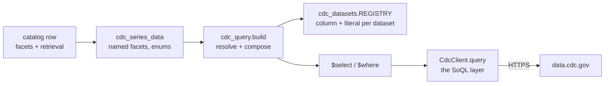

# CDC Reference — API and data source

Reference for the U.S. Centers for Disease Control (CDC) integration: the CDC
open-data **Socrata (SODA) API** — data, dataset metadata, and catalog discovery,
exposed as MCP tools. Built and in use — `CdcClient` + models in `meida/clients/`,
**six MCP tools**, a `series_catalog` table that makes the ~2,500 Socrata series
enumerable, and eight notebooks under `notebooks/cdc/`.

CDC fills the SDT **immiseration health leg** — life expectancy, mortality, and
*deaths of despair* (drug overdose + suicide + alcohol). Unlike BLS surveys or BIS
dataflows (uniform, enumerable), CDC is **one API over ~1,472 heterogeneous
datasets**, so the client stays generic and the useful datasets are **curated**,
not enumerated.

## Access

- **Base URL:** `https://data.cdc.gov` (`get_cdc_base_url()`; override with
  `CDC_BASE_URL`). Reading public data needs **no credentials**.
- **Optional app token** (`CDC_API_KEY`, `get_cdc_api_key()`) — a Socrata *app
  token*, **not** an API key/secret. It only **raises rate limits** and is sent in
  the `X-App-Token` header when present. Get one from a free Socrata account →
  developer settings.
- Two hosts:
  - **Portal** `data.cdc.gov` — a dataset's rows (`/resource/{id}.json`) and its
    columns (`/api/views/{id}.json`).
  - **Discovery** `api.us.socrata.com/api/catalog/v1` — cross-domain catalog
    search + facets. *Not* on `data.cdc.gov`.
- Docs: [Socrata SODA](https://dev.socrata.com/) · [CDC data portal](https://data.cdc.gov/)

## The core challenge → the design

One API, **many datasets with inconsistent schemas** — each dataset has its own
time / value / facet columns, and the six curated datasets need **four different
query shapes** between them. So the client stays a **thin generic SoQL fetcher**,
and the real work is a **per-dataset field mapping** that sits above it in
`mcp_server/cdc_datasets.py` — one contract, read by both the MCP tool and the
catalog export, so the vocabulary the tool accepts and the vocabulary the catalog
advertises cannot drift apart. A dataset is addressed by a 4×4 id (e.g.
`w9j2-ggv5`). **Socrata returns every value as a string** — casting is the
caller's job.

## Resources (endpoints)

### 1. Data — `GET /resource/{id}.json`

Rows via SoQL query params: `$where` (predicate, e.g. `race='All Races' AND
year>2010`), `$select`, `$order`, `$group`, `$limit`, `$offset` (page a large
dataset). String equality is exact/case-sensitive.

### 2. Columns — `GET /api/views/{id}.json`

A dataset's metadata + columns (`fieldName`, `dataTypeName`, `name`). Inspect
these before querying — schemas differ per dataset.

### 3. Discovery — `GET api.us.socrata.com/api/catalog/v1`

- **Search:** `?domains=data.cdc.gov&q=<keyword>&categories=<domain_category>&limit=`.
  ⚠️ Filtering by a **domain category** requires `search_context=data.cdc.gov`;
  the plain `categories` param (canonical Socrata categories) returns 0 because
  CDC uses its own domain categories.
- **Categories:** `/domain_categories?search_context=data.cdc.gov` — the topic map
  with dataset counts (NNDSS 295, National Center for Health Statistics 287, NIOSH
  177, Vaccinations, Behavioral Risk Factors, …).
- **Tags:** `/domain_tags?search_context=data.cdc.gov` — finer topics
  (`mortality`, `covid-19`, `prevalence`, …).

## The curated datasets

The SDT health slice (not the whole portal). Each needs its own field mapping:

| id | dataset | shape | → series |
| --- | --- | --- | --- |
| **w9j2-ggv5** | Death rates & life expectancy, **1900–2018** | `year × race × sex` → `{average_life_expectancy, mortality}` | (metric, race, sex) over year |
| **9j2v-jamp** | Suicide death rates, **1950→** | NCHS "stub" schema: `indicator / unit / stub_label / age / year → estimate` | (stub_label, age) over year |
| **xkb8-kh2a** | Provisional drug-overdose death counts | `state × month × indicator(drug) → data_value` | (state, drug) over year-month |
| **hksd-2xuw** | Chronic Disease Indicators — **Alcohol topic**, 2019–2023 | long: `topic/questionid × location(state) × stratification × yearstart → datavalue` (typed by `datavaluetype`/`datavalueunit`) | ALC08 consumption + ALC06 binge (**exposures**); ALC09 chronic-liver mortality (**alcohol-death proxy**) |
| **w26f-tf3h** | DQS suicide death rates, **2018–2024** — the current continuation of `9j2v-jamp` | NCHS stratified: `group`/`subgroup` name the one active breakdown, `estimate_type` the rate → `estimate` | (breakdown value, rate_type) over year |
| **489q-934x** | VSRR quarterly provisional death rates, **2023 Q1–2025 Q3** | wide: `cause_of_death × rate_type × time_period` → one rate column per cut (`rate_overall`, `rate_sex_male`, …) | (cause, sex, rate_type) over year-quarter |

Facet values are precise. For `w9j2-ggv5`: races `All Races / Black / White` (only
these — no Hispanic/Asian breakdown), sexes `Both Sexes / Female / Male`. Callers
never type those literals — `cdc_dataset_facets` reports the canonical tokens one
dataset defines, and the server maps them; see
[Fetching a series](#fetching-a-series-named-facets-not-soql).

## Deaths of despair

= drug overdose + suicide + **alcohol** (Case & Deaton). Overdose (`xkb8-kh2a`)
and suicide (`9j2v-jamp`) each have a dedicated dataset; **alcohol does not** — an
exhaustive catalog sweep found **no alcohol-induced-deaths dataset on the Socrata
portal** (see *The alcohol leg* below). The catalog holds the **components**; the
composite (their sum, for working-age adults) is an **analysis-side** construct
(alef/yada), not stored raw.

## The alcohol leg

Alcohol harm is **multi-channel** and no single Socrata dataset captures it as
deaths, so we curate what exists and defer the exact measure:

- **Chronic disease (liver).** `hksd-2xuw` question **ALC09** "Chronic liver
  disease mortality, underlying cause" (annual 2019–2022, state-level, counts +
  crude/age-adjusted rates) — the recognized but **imperfect proxy** (over-counts
  non-alcohol liver disease: hepatitis, NAFLD; under-counts non-liver alcohol
  deaths). Also in `489q-934x` (VSRR, quarterly, provisional, rates only), which
  co-hosts suicide + overdose.
- **Risk-factor exposures.** `hksd-2xuw` **ALC08** per-capita consumption
  (gallons) and **ALC06** binge-drinking prevalence — alcohol *use*, curated as
  **exposures, not deaths**. ⚠️ At the state-aggregate level these correlate **~0**
  with liver mortality (pooled cross-state Pearson r ≈ −0.04 for both) — ecological
  confounding (sales ≠ resident drinking, demographics, tourism). Not a proxy
  shortcut; a real use→mortality link needs individual/panel modeling (alef/yada).
- **Acute injury.** `haed-k2ka` alcohol-impaired *driving* deaths — a different
  (injury) channel, but a **frozen 2005–2014 cumulative total per state**, not a
  time series (the live version is NHTSA FARS, off-Socrata).
- **The exact measure** — the ICD-10 *alcohol-induced causes* grouping (alcoholic
  liver disease + poisoning + cardiomyopathy + …) — is **CDC WONDER-only**, no
  Socrata mirror. Now built: it is one of the stored WONDER series, reached
  through `timeseries_source_data`; see [wonder-nvsr.md](wonder-nvsr.md).

## Data quirks

- **Everything is a string** → cast (`year`, `average_life_expectancy`, … all
  arrive as text).
- **Suppressed cells.** `w9j2-ggv5` omits `average_life_expectancy` for **Black &
  White in 2018** (all sexes) while their mortality is present — so race-broken-out
  life-expectancy ends at 2017 while `All Races` runs to 2018. `xkb8-kh2a` marks
  low-quality rows with a `footnote_symbol` and null `data_value`.
- **Provisional & revised.** `xkb8-kh2a` is provisional, gets revised, and uses a
  rolling **12-month-ending** window (`period`).
- **CDC WONDER** (finer mortality-by-cause/age) is a separate, harder source
  (XML-POST, throttled behind a bot filter) — not reachable through any tool on
  this page; it is pulled once into the database and served from there. See
  [wonder-nvsr.md](wonder-nvsr.md).
- **"AH" means "Ad Hoc"**, not alcohol — the `AH Provisional … Death Counts`
  family (`qdcb-uzft` Diabetes, Cancer, Sickle Cell) has **no alcohol member**;
  don't chase it looking for an alcohol sibling.

## The integration (built)

`CdcClient` (`meida/clients/cdc.py`) wraps the API. It used to live in
`navi/lib/clients`; meida was the only consumer, so it moved here and now only
borrows navi's genuinely shared bits (`lib.logger`):

- `query(id, where=, select=, order=, group=, limit=, offset=)` → rows; `iter_all(…)`
  pages a whole dataset.
- `columns(id)` → a dataset's columns.
- `discover(query="", category=None, limit=)` → catalog search; `categories()` /
  `tags()` → the facet maps.
- Sends `X-App-Token` per-request when `CDC_API_KEY` is set; `CdcAPIError` on HTTP
  errors. Rows are heterogeneous dicts (`CdcDataResponse`); structure via
  `CdcColumn` / `CdcDataset`; facets via `CdcCategory` / `CdcTag`.

**The client is the SoQL layer, and the only one.** It still speaks `$where` /
`$select` because that is what Socrata speaks; nothing above it does.

**Six MCP tools** in `meida/mcp_server/server.py`:

| tool | what it does |
| --- | --- |
| `cdc_discover` | keyword / category search of the Socrata catalog → dataset ids |
| `cdc_categories`, `cdc_tags` | the domain-category and tag maps, with counts |
| `cdc_dataset_columns` | one dataset's raw columns, types and labels |
| `cdc_series_data` | **one series, selected by named facets** — see below |
| `cdc_dataset_facets` | the facet tokens one dataset actually defines |

`cdc_discover`, `cdc_categories`, `cdc_tags` and `cdc_dataset_columns` are
exploration tools: they speak the portal's own vocabulary (dataset ids, raw
column names) and are how an uncurated dataset gets understood well enough to be
curated. `cdc_series_data` and `cdc_dataset_facets` are the fetch interface, and
they speak the catalog's vocabulary instead.

**Config** in `environment.py`: `get_cdc_api_key()` (`CDC_API_KEY`, optional →
`X-App-Token`) and `get_cdc_base_url()` (`CDC_BASE_URL`).

**Notebooks + code** (`notebooks/cdc/`). Three of them are the shared per-source
arc every meida source now has — `mcp.ipynb` (the tools, their schemas, and both
delivery routes), `walkthrough.ipynb` (discovery → fetch → plot through the
server), `client.ipynb` (the same arc against `CdcClient` and `WonderClient`
directly, no server in between) — plus the CDC-specific ones: `api.ipynb`
(discover → inspect → query → plot), `discovery.ipynb` (browse by category/tag),
`series_over_multipe_data_sets.ipynb` (stitch history + current across datasets —
suicide 1950→2024, life expectancy 1900→2020, the VSRR despair triad),
`catalog.py` + `catalog.ipynb` (the registry walk and catalog export; see
*Series catalog* below), and `wonder.ipynb` (see
[wonder-nvsr.md](wonder-nvsr.md)).

> The notebooks drive the **running** MCP server, which does not hot-reload — after
> adding/changing tools, fully restart it (and watch for an orphan holding `:8080`).

---

## Fetching a series: named facets, not SoQL

`cdc_series_data` once took a raw `$where` string. It does not any more. It takes
**named facets** — `state`, `race`, `sex`, `age`, `drug`, `rate_type`, `period` —
beside `dataset_id`, `concept`, `year_start`, `year_end` and `limit`. The dataset,
concept and facet parameters are typed as `Literal`s, so each lands in the tool's
JSON Schema as an `enum` and a client sees the accepted vocabulary without reading
prose. The server builds the query. **No SoQL crosses the wire.**



- `mcp_server/cdc_datasets.py` — the **contract**: per dataset, which column each
  facet is and which literal each canonical token becomes.
- `mcp_server/cdc_query.py` — the **builder**: `build()` resolves tool arguments
  against that registry into a `$select`/`$where` pair; `vocabulary()` answers
  what a single dataset defines. The tool's enums are derived from the registry
  by `_union()` rather than written out, so an advertised token is always one the
  builder can resolve.

### Why the indirection is not ceremony

Because the same facet is a different column in every dataset. Asking for
`race=black`:

| dataset | query shape | what the builder emits |
| --- | --- | --- |
| `w9j2-ggv5` | cross | `race='Black'` — a column of its own |
| `w26f-tf3h` | stratified | a category/value pair: `group='Race and Hispanic origin' AND subgroup='Black only, non-Hispanic'` (`group` is a SoQL reserved word, so it is backticked) |
| `hksd-2xuw` | stratified | `stratificationcategory1='Race/Ethnicity' AND stratification1='Black, non-Hispanic'` |
| `9j2v-jamp` | NCHS stub | a scheme name plus a label composed from every active facet — and `race` alone is not a shape it publishes, so this one needs `sex` too: `race='black', sex='female'` becomes `stub_name='Sex and race' AND stub_label='Female: Black or African American'`. Asking for `race` on its own raises, naming the four combinations it does publish: none, `age+sex`, `race+sex`, `sex`. |

The other facets are no better behaved. `drug` is the `indicator` column on
`xkb8-kh2a` (`indicator='Opioids (T40.0-T40.4,T40.6)'`). `state` is `state` on
`xkb8-kh2a` but `locationabbr` on `hksd-2xuw`. On `489q-934x` — the fourth query
shape, a **column melt** — `sex` is not a row filter at all: it chooses which
wide column to read (`rate_overall` / `rate_sex_male` / `rate_sex_female`), and
the concept picks the `cause_of_death` row. And one real-world category has three
spellings across four datasets: `white` is `White`, `White only, non-Hispanic`,
and `White, non-Hispanic` depending on where you ask.

No caller can be expected to carry that, which is exactly what made a raw-SoQL
tool the wrong interface. Two things fall out of moving it server-side:

- **Facet values are looked up, never interpolated.** `race="all' OR 1=1 --"` is
  rejected against the vocabulary rather than executed.
- **Errors name the way out.** The enums are the *union* across datasets, so a
  token valid on one is routinely absent from another; a rejection lists what
  this dataset does accept — `race='hispanic' is not valid for this dataset;
  valid values: all, black, white`.

### The two pivot modes

**Cross** — the facets are independent columns, so the Cartesian product is real:
`w9j2-ggv5` is race × sex, `xkb8-kh2a` is state × drug. Ask for both, get both.

**Stratified** — the dataset publishes **one demographic breakdown at a time**.
Every row names its own stratification (`Sex`, `Race/Ethnicity`, `Age`) and
carries the value for that one dimension; there is no row where age and race are
both resolved. `w26f-tf3h` and `hksd-2xuw` are shaped this way, and asking for
two at once is not a query the server declines to write — it is **a series that
was never published**:

```text
this dataset stratifies one dimension at a time; got age, race -- pass only one
```

`9j2v-jamp` states the same restriction as an enumeration: it publishes exactly
four label schemes — total, `sex`, `sex`+`age`, `sex`+`race` — so `race` on its
own, or `race`+`age`, comes back with the combinations that exist rather than an
empty row set. `hksd-2xuw` crosses its stratification with a location
(`locationabbr`), which is why `state` composes with a breakdown there while two
breakdowns still do not.

### When the period spans two columns

The facet mapping above is the variation everyone expects. The **time** column
varies too, and less visibly.

Five of the six datasets have one column that identifies an observation:
`year` on `w9j2-ggv5`, `yearstart` on `hksd-2xuw`, `time_period` on
`w26f-tf3h`, `year_and_quarter` on `489q-934x`. `xkb8-kh2a` does not. It
publishes **monthly** and keys each row by `year` *and* `month`, so a select
naming only the time column returns twelve rows a year all carrying the same
label — twelve points claiming one period, in whatever order the API returned
them. That is what it did until September 2026; the spec had said
`frequency="monthly"` the whole time, and nothing compared the two halves.

Socrata cannot fold the columns for us. There is no `concat()`, and `||`
returns an empty result rather than an error — a silent wrong answer, which is
worse than a rejection. So `Spec.month_field` marks a dataset whose period is
split, `_select` emits both columns, and `cdc_query.compose_period` builds
`2020-01` after the fetch:

```text
select year, month, data_value AS value      # not `year AS year, ...`
                    ↓
{'year': '2020-01', 'value': '492'}
```

**Ordering moves client-side with it.** `$order=year` leaves the months
arbitrary, and adding `month` sorts them *alphabetically* — April, August,
December. `compose_period` sorts on the composed label instead, which is why
`build()` returns `order: None` for a split-period dataset.

The catalog's coverage bounds needed the same treatment: `_span` took
`min/max(year)` and reported `2015..2026` where the data runs
`2015-01..2026-03`. For a split-period dataset it now enumerates the distinct
pairs — a few hundred rows — and composes the bounds.

`tests/test_server.py` asserts that no spec claims a sub-annual frequency while
selecting only a bare year column, so the next dataset with this shape fails at
test time rather than in a plot.

**One thing the fix does not address.** Every `xkb8-kh2a` value is a
*12-month-ending* count: December 2020 is the twelve months **ending** in
December, not December's deaths. Consecutive points overlap by eleven months,
so differencing them gives `deaths(m) − deaths(m−12)` rather than a monthly
figure, and the December point alone equals the calendar year. `frequency:
monthly` describes when the number is published, not what it measures.

### `cdc_dataset_facets`, and when a concept is required

The registry is keyed by `(dataset_id, concept)` because neither is unique alone.
`cdc_series_data` therefore **requires `concept`** wherever one dataset serves
several — and for three different reasons:

- `w9j2-ggv5` — `life_expectancy` and `mortality` read **different value
  columns** (`average_life_expectancy` vs `mortality`). A guess would return the
  wrong number rather than an error, which is why this one is not relaxed.
- `hksd-2xuw` — the concept *is* part of the row filter (`questionid` ALC08 /
  ALC06 / ALC09).
- `489q-934x` — the concept is the `cause_of_death` value.

`cdc_dataset_facets` asks for one **only when it changes the answer**. Of the six
datasets only `hksd-2xuw` genuinely differs by concept: `alcohol_consumption`
publishes no demographic breakdown at all (state only), while `alcohol_binge` and
`chronic_liver_mortality` publish sex, race, age and a rate type. Everywhere else
a dataset's concepts share one vocabulary, so `cdc_dataset_facets("w9j2-ggv5")`
answers without a concept and demanding one would be friction, not precision.

### The response

`cdc_series_data` returns a typed `CdcSeriesResponse`: `dataset_id`, `concept`,
`row_count`, `rows` of `{year, value}` (strings — Socrata's, uncast), and the
resolved `where`. That last field is **provenance — an output, never an input**;
it is there so a result can be traced back to the predicate that produced it.

Every query the builder emits selects the dataset's time column `AS year` and
writes the range bounds against that alias, because Socrata resolves a `$select`
alias inside `$where` — which matters, since `489q-934x` has no `year` column at
all (its time field is `year_and_quarter`). The bounds are quoted on both sides:
a bare number fails against a text time column, while a quoted literal against a
numeric column is still compared numerically.

---

## Series catalog (built)

The **registry** is CDC's hand-written stand-in for BIS's SDMX structure: seven
`Spec` entries covering four datasets, plus the two special-case specs (`StubSpec`
for `9j2v-jamp`, `VsrrSpec` for `489q-934x`) and their value-normalization maps.
It lives in `mcp_server/cdc_datasets.py` — with the server, because the server is
its primary consumer — and `notebooks/cdc/utils/catalog.py` imports from it rather than
keeping a second copy. That import is the point: the tool's accepted vocabulary
and the catalog's `facets` keys are the same dictionaries, so they cannot drift.

`export_cdc_catalog()` walks each spec and writes the **series catalog** to
`notebooks/cdc/data/` (gitignored, regenerable; run via `catalog.ipynb`): a
`dataset.yaml` index + one `cdc_series_<group>.yaml` per source group. **2,346
atomic Socrata series** — one per facet permutation, like FRED/BIS.

Each entry carries **normalized `facets`** plus descriptive metadata (`concept`,
`unit`, `frequency`, `cadence`, `provisional`, `observation_start/end`). The
export also records the `where` and `select` it derived for that permutation, but
those are now **provenance, not a call** — a note of how the entry was
enumerated. Nothing replays them: the `series_catalog` table has no `where`
column, and the fetch path takes the facets instead.

| group | series | concepts |
| --- | --- | --- |
| `hksd-2xuw` | 1,816 | alcohol_consumption, alcohol_binge, chronic_liver_mortality |
| `xkb8-kh2a` | 424 | drug_overdose |
| `9j2v-jamp` | 42 | suicide (history 1950–2018) |
| `w26f-tf3h` | 28 | suicide (current 2018–2024) |
| `w9j2-ggv5` | 18 | life_expectancy, mortality (1900–2018) |
| `489q-934x` | 18 | suicide, drug_overdose, chronic_liver_mortality (VSRR) |

**How the export tames the mess** (the pivot modes and the value normalization
are the registry's, described under
[Fetching a series](#fetching-a-series-named-facets-not-soql); these two are the
export's own):

- **Reality-driven** — a per-spec `group_by … WHERE value IS NOT NULL` enumerates
  only combos that exist, so suppressed cells, non-curated strata (`Grade`),
  overlapping age aggregates, and meta drug indicators never become entries.
- **Three special-case handlers** — the suicide **stub parser** (`9j2v` splits the
  colon-delimited `stub_label` into sex/race/age), the VSRR **column-melt**
  (`489q-934x` sex lives in wide columns, so the value column is chosen in
  `select`), and the LE **snapshot union** (four single-year datasets → one
  per-`(area, sex)` series). The first two now have counterparts in `cdc_query`,
  so those series are fetchable in one call. The snapshot union does not — it
  needs several sub-queries — which is why its 156 entries are catalogued but
  carry no fetch tool.

### Where it is served from

The exported YAML is build output that no runtime code reads. `load_catalog.py`
upserts it into the **`series_catalog`** table (its own Alembic migration,
`8f31c0a4e7d2`), keyed on `(source, series_id)` and pruning rows the export no
longer produces. That table is what makes Socrata **discoverable**: before it,
`timeseries_source_list` could enumerate the 180 stored series (171 NVSR + 9
WONDER) and nothing could enumerate the ~2,500 live ones — you could fetch a
Socrata series only if you already knew its facets.

`SeriesCatalogClient` serves it through three tools:

| tool | answers |
| --- | --- |
| `series_catalog_search` | which series exist — exact filters on `source`, `dataset_id`, `concept` and `active_only`, plus JSONB containment on `facets`; capped at 200 rows and returning `total` alongside `returned`, so a truncated result is visible as one |
| `series_catalog_entry` | one entry by `series_id` |
| `series_catalog_concepts` | the coarse map: concept × dataset with series counts |

Search is exact, not fuzzy, on purpose. Descriptions are generated per *bucket*
of series that differ only by facet value, so the 1,014 `alcohol_binge` entries
share a handful of description strings — free-text ranking cannot separate them
and facet filtering is the only thing that can. Semantic search over the
descriptions is yada's document store's job; this is the exact-match index
underneath it.

### The facets round-trip

The catalog's `facets` keys are the tool's argument names — the same constant in
the same module, not two lists kept in step by hand — so a row read out of
`series_catalog_search` feeds straight back into `cdc_series_data` with nothing
in between:

```json
{
  "series_id": "cdc/alcohol_binge/hksd-2xuw/state=tx/race=black/age_adjusted",
  "facets": {"state": "TX", "race": "black", "rate_type": "age_adjusted"},
  "retrieval": {
    "tool": "cdc_series_data",
    "dataset_id": "hksd-2xuw",
    "concept": "alcohol_binge",
    "facets": {"state": "TX", "race": "black", "rate_type": "age_adjusted"}
  }
}
```

The `retrieval` block is what lets **one listing span both delivery routes**. Of
the 2,526 CDC catalog rows: **2,346** name `cdc_series_data` (live Socrata) and
**180** name `timeseries_source_data` (the stored WONDER and NVSR series — see
[time-series-source.md](../time-series-source.md)). A consumer asks the catalog
what exists and is told, per series, which door to use.

`tool` stays nullable, but nothing is null today. It held the `le_snapshots`
group — 156 state life-expectancy series assembled from four single-year
datasets, so no single call could fetch them — until those datasets turned out
to be the NVSR state life tables rounded to one decimal, which the stored
series already carry with an extra year. The group was deleted rather than
given a union tool, and a test now asserts nothing reaches the null branch.

### Known gaps

- **Alcohol** has no dedicated Socrata deaths dataset — curated as the ALC09
  chronic-liver proxy + ALC08/ALC06 use exposures (`hksd-2xuw`). The exact
  alcohol-induced series now comes from **CDC WONDER** — built (`WonderClient` in
  `meida/clients/wonder.py`, `notebooks/cdc/wonder.ipynb`), pulled once and served
  from the database; see [wonder-nvsr.md](wonder-nvsr.md).
- **Life expectancy caps at 2020** nationally on Socrata (recent years are the
  state-snapshot union 2018–2021; national only via each snapshot's US row,
  2018–2020). Extension past 2020 comes from the **NVSR life-table Excel files
  on FTP** (final 2024 = 79.0, above pre-COVID) — the earlier "dropped, Socrata
  only" call was reversed once the files proved machine-readable; see
  [wonder-nvsr.md](wonder-nvsr.md).
- **`xkb8-kh2a` / `489q-934x` are provisional** and revised (injury deaths lag) —
  each entry's `provisional` flag and `observation_end` (= last populated) reflect
  this; treat the most-recent quarters as preliminary.
