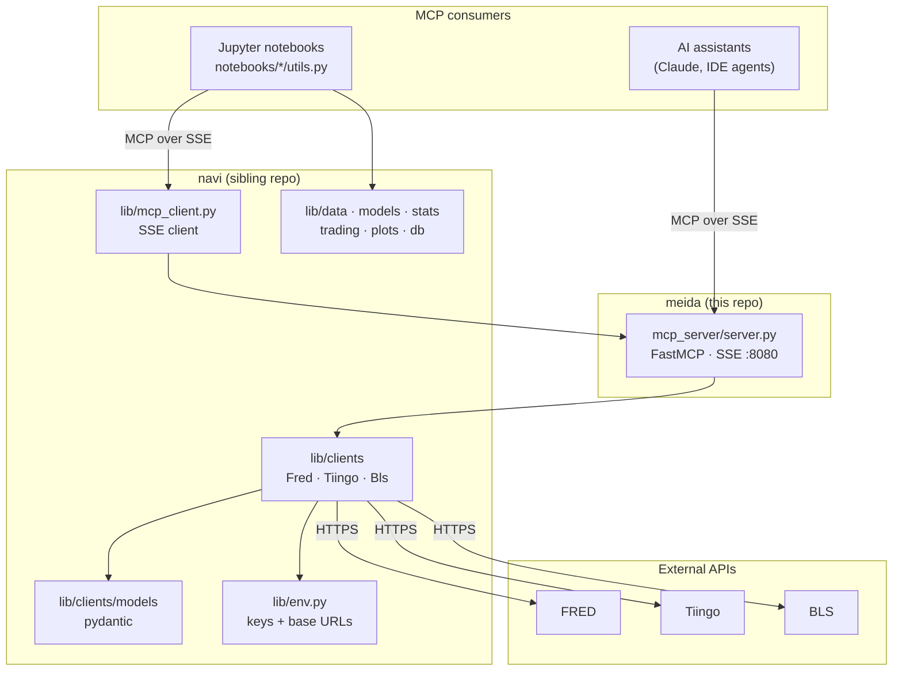
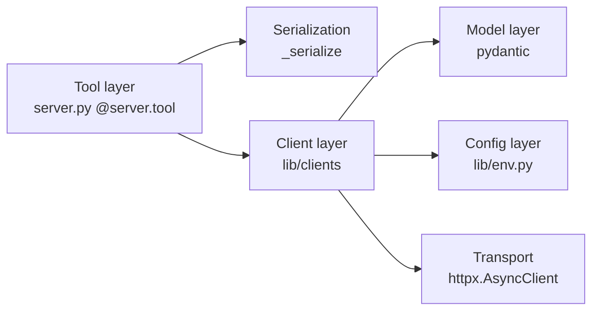
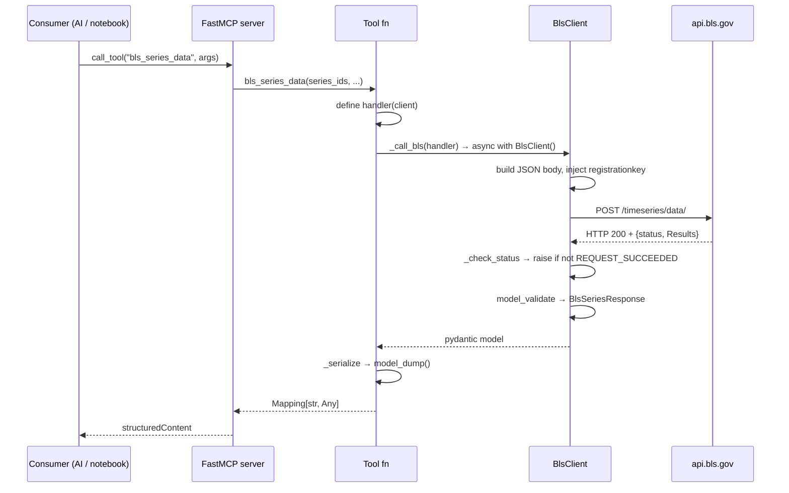

# Architecture

How **meida** and **navi** fit together to expose economic and financial data to
AI tooling and notebooks.

---

## 1. System context

**meida** is an MCP server and notebook workspace. **navi** is the library it
stands on: async API clients, typed models, environment config, statistical
models, and plotting. meida depends on navi; navi never depends on meida.



Notebooks reach data **through the MCP server**, not by calling navi's clients
directly. The notebooks are themselves MCP clients — the server gets dogfooded
by the same interface the AI tooling uses. Notebooks do import navi's analysis
and plotting modules directly.

---

## 2. Repository layout

### meida

| Path | Role |
| --- | --- |
| `mcp_server/server.py` | FastMCP server; all tool definitions |
| `notebooks/fred/`, `notebooks/tiingo/`, `notebooks/bls/` | Per-source exploration + data discovery; each has a `utils.py` of MCP helpers |
| `tests/` | Unit tests for meida **and** navi's clients (see §7) |
| *(docs)* | In the shared `sefer` repo — see [../README.md](../README.md) |
| `requirements.in` / `.txt` | Runtime deps, pip-compiled; includes `-e ../navi` |
| `requirements-dev.in` / `.txt` | Test-only deps (pytest, pytest-asyncio) |
| `pytest.ini` | `testpaths=tests`, `pythonpath=.`, `asyncio_mode=auto` |

### navi

| Path | Role |
| --- | --- |
| `lib/env.py` | API keys and base URLs from `navi/.env` |
| `lib/clients/` | Async HTTP clients: `fred.py`, `tiingo.py`, `bls.py` |
| `lib/clients/models/` | Frozen pydantic models per provider |
| `lib/mcp_client.py` | SSE MCP client wrapper (`MCPClient`, `MCPClientConfig`) |
| `lib/logger.py` | Colorized logger (`get_logger`) |
| `lib/data/`, `lib/models/`, `lib/stats.py` | ADF, ARIMA, VAR, VECM, ECM, BM, fBM, OU |
| `lib/trading/`, `lib/db/` | backtrader strategies, metrics, Postgres persistence |
| `lib/plots/` | matplotlib visualizations |
| `lib/config.py` | matplotlib/style configuration |

navi is installed into meida as an **editable local package** (`-e ../navi`),
so `import lib.clients` resolves live from the sibling checkout. `pyrightconfig.json`
mirrors this with `extraPaths: ["../navi"]`.

---

## 3. Layers and dependency direction



Dependencies point in one direction. Each layer has a single responsibility:

- **Tool layer** — MCP surface: names, descriptions, parameter defaults, and
  assembling provider call arguments. Owns no HTTP logic.
- **Client layer** — HTTP mechanics, auth injection, error translation.
- **Model layer** — payload shape and validation. No I/O.
- **Config layer** — secrets and base URLs. Read-only, env-backed.

---

## 4. Request flow

End-to-end for `bls_series_data`:



The `_call_X(handler)` indirection exists so the tool function owns *what to
ask for* while the helper owns *client lifecycle and serialization*. It also
makes tools trivially testable — tests patch `_call_bls` and run the handler
against a recording fake (§7).

---

## 5. The client pattern

All three clients share a deliberate shape:

```python
class XClient:
    def __init__(self, *, api_key=None, base_url=None, timeout=30.0, client=None):
        self.api_key = api_key or get_x_api_key()
        self.base_url = (base_url or get_x_base_url()).rstrip("/")
        self._client = client or httpx.AsyncClient(base_url=..., timeout=...)
        self._owns_client = client is None      # don't close a caller's client

    async def __aenter__/__aexit__/aclose        # async context manager
    async def _get(...) -> dict                  # auth injection + error wrapping
    async def get_thing(...) -> TypedModel       # model_validate the payload
```

Two properties matter architecturally:

- **Injectable transport.** The `client=` parameter is what makes the whole
  suite hermetic — tests pass an `httpx.AsyncClient` backed by `MockTransport`.
  `_owns_client` ensures a caller-supplied client isn't closed underneath them.
- **Errors are translated at the boundary.** Each client raises its own
  `XAPIError`, so callers never handle raw `httpx` exceptions.

### Provider differences

The abstraction is intentionally thin — the providers genuinely differ:

| | FRED | Tiingo | BLS |
| --- | --- | --- | --- |
| Method | GET | GET | **POST** (multi-series) + GET |
| Auth | `api_key` query param | `Authorization: Token` header | `registrationkey` in **body**/query |
| Key required | Yes | Yes | **No** (reduced limits) |
| Errors | HTTP status | HTTP status | **HTTP 200 + `status` field** |
| Extras | `file_type=json` forced | camelCase params | `catalog`/`calculations` flags |

BLS is the outlier on every row. Its client checks `status != "REQUEST_SUCCEEDED"`
and raises, while tolerating advisory `message[]` entries on success (e.g. "Year
range has been reduced to the system-allowed limit of 20 years" is a *warning*,
not a failure).

---

## 6. Models

Pydantic v2, `frozen=True` throughout — responses are immutable value objects.
Conventions:

- **Aliases map wire → python:** `seriesID` → `series_id`, `periodName` →
  `period_name`, `adjClose` → `adj_close`, `Results` → `results`.
- **Provider quirks are absorbed here, not in callers.** FRED's `last_updated`
  validator normalizes a short timezone suffix (`-05` → `-0500`) and falls back
  to naive parsing. BLS's `Catalog` sets `extra="allow"` because its fields vary
  per survey. Numeric-looking values that arrive as strings (BLS `value`, `year`)
  stay strings.
- **`_serialize` in server.py** converts models to dicts via `model_dump()`, so
  MCP consumers see snake_case field names. It accepts a model or a mapping and
  raises `TypeError` otherwise.

---

## 7. Testing strategy

All tests live in **meida** (`tests/`), covering meida's server *and* navi's
`lib/clients`. navi's analysis modules are tested elsewhere. 59 tests, ~0.1s.

| File | Covers |
| --- | --- |
| `test_server.py` | `_serialize`, per-tool parameter assembly, observations warning, BLS tool wiring |
| `test_{fred,tiingo,bls}_client.py` | Request construction, auth injection, model parsing, error translation |
| `test_{fred,tiingo,bls}_models.py` | Aliases, validators, defaults, immutability |

Two techniques carry the suite:

1. **`httpx.MockTransport`** via the `make_*_client` conftest fixtures. No
   network, no API keys — clients take explicit `api_key`/`base_url`. The
   fixtures are async so injected transports get closed on teardown.
2. **Recording fakes** for tool tests: patch `server._call_bls` (etc.) and run
   the handler closure against a fake client that records calls. This isolates
   meida's argument-assembly logic from navi entirely.

`tests/fixtures/bls/*.json` are **real responses captured from the live BLS
API** — they pin the model layer to reality (they're what revealed `Results` is
an object, not the array the BLS docs show). They contain no secrets.

---

## 8. Configuration and secrets

`navi/lib/env.py` is the single source of truth. It loads `navi/.env` at import
(overridable with `NAVI_ENV_FILE`), so **both repos share one credentials file**.

| Variable | Default | Notes |
| --- | --- | --- |
| `FRED_API_KEY` | — | required |
| `TIINGO_API_KEY` | — | required |
| `BLS_API_KEY` | — | optional; raises limits, enables `catalog`/`calculations` |
| `FRED_BASE_URL` | `https://api.stlouisfed.org/fred` | |
| `TIINGO_BASE_URL` | `https://api.tiingo.com/tiingo` | |
| `BLS_BASE_URL` | `https://api.bls.gov/publicAPI/v2` | |
| `MCP_URL` | `http://localhost:8080/sse` | used by notebooks |

Accessors are `lru_cache`d and raise a descriptive error when a required key is
missing. `get_bls_api_key(required=False)` returns `None` instead — the one
accessor that tolerates absence, because BLS works keyless.

---

## 9. Data discovery and generated data

Each source has a notebook workflow that pulls catalog metadata down to local
YAML. The outputs are **git-ignored and regenerable** — they were large enough
that the FRED series data (~206 MB) was purged from git history.

| Source | Discovery model | Output (ignored) |
| --- | --- | --- |
| FRED | Category tree walk → leaf categories → series per leaf | `notebooks/fred/{categories/category_data,series/series_data}/` |
| BLS | Flat-file catalog from `download.bls.gov` → survey + series metadata | `notebooks/bls/data/` (catalog), `notebook_downloads/` (observations) |

For BLS the catalog is built from the **flat files** (`download.bls.gov`), not
the API — the API can only enumerate ~25 popular series per survey and lacks
coverage dates. The result is a **survey/series** metadata model (`survey.yaml` plus one
`bls_series_<CODE>.yaml` per survey, ~288k series across 22 economic surveys and
a filtered OE occupation slice), the analog of FRED's
category/series with faceted classification instead of a category path. Two
operational notes: the fetch needs `curl_cffi` (browser TLS fingerprint) to
pass BLS's bot filter, and observations are fetched from the API separately —
the catalog is metadata only. See [api/bls.md](api/bls.md).

---

## 10. Known inconsistencies

Worth knowing before extending; none are currently breaking.

- **Tool naming.** `list_releases` lacks the `fred_` prefix used by every other
  FRED tool, and its description is copy-pasted from `fred_release_series`
  ("List the series that belong to a FRED release") rather than describing
  listing releases.
- **`fred_category_children`** calls the client's private `_get` directly
  instead of the public `get_category_children`, so it returns a raw dict rather
  than a `CategoryResponse`.
- **BLS docs vs reality.** BLS documents `Results` as an array; the live API
  returns an object. The models follow reality — see `api/bls.md`.

---

## 11. Adding a new data source

The BLS integration is the reference implementation. Order matters — explore
before you model.

1. **Explore.** Hit each endpoint once, capture real responses as fixtures. Do
   not model from documentation alone.
2. **Config.** Add `get_x_api_key()` / `get_x_base_url()` to `lib/env.py` plus
   entries in `.env.example`.
3. **Models.** `lib/clients/models/x.py` — frozen, aliased, tolerant where the
   provider is inconsistent.
4. **Client.** `lib/clients/x.py` — the §5 shape, with an `XAPIError`. Export it
   from `lib/clients/__init__.py`.
5. **Tools.** Add `_call_x` and `@server.tool` functions in `mcp_server/server.py`.
6. **Tests.** `tests/test_x_client.py` + `test_x_models.py` against the captured
   fixtures; add tool tests to `test_server.py`.
7. **Discovery.** `notebooks/x/utils.py` + notebooks; git-ignore the data dirs.
8. **Docs.** Update the README and add a reference doc here.

---

## 12. Runtime

```bash
python mcp_server/server.py      # FastMCP, SSE, 0.0.0.0:8080 → /sse
pytest tests                     # 59 tests, no network
```

`.vscode/launch.json` provides debugpy configurations for both ("Run MCP server
(stdio)" and "Run tests (pytest)"). The server is single-process and stateless —
every tool call constructs a fresh client and closes it, so there is no
connection pooling or shared session across calls.
