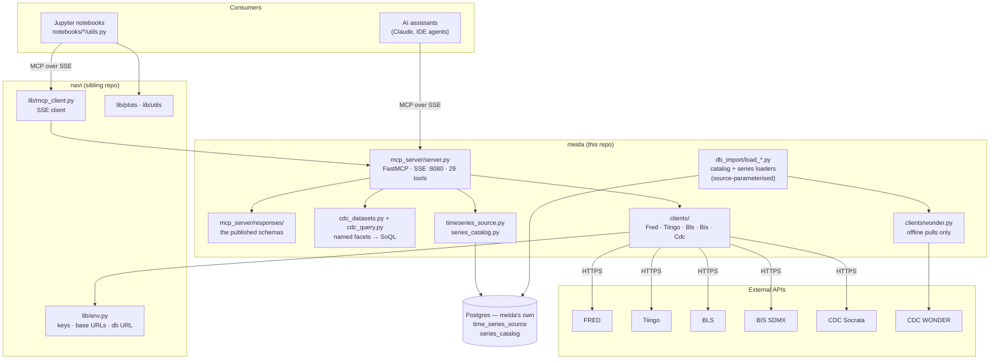
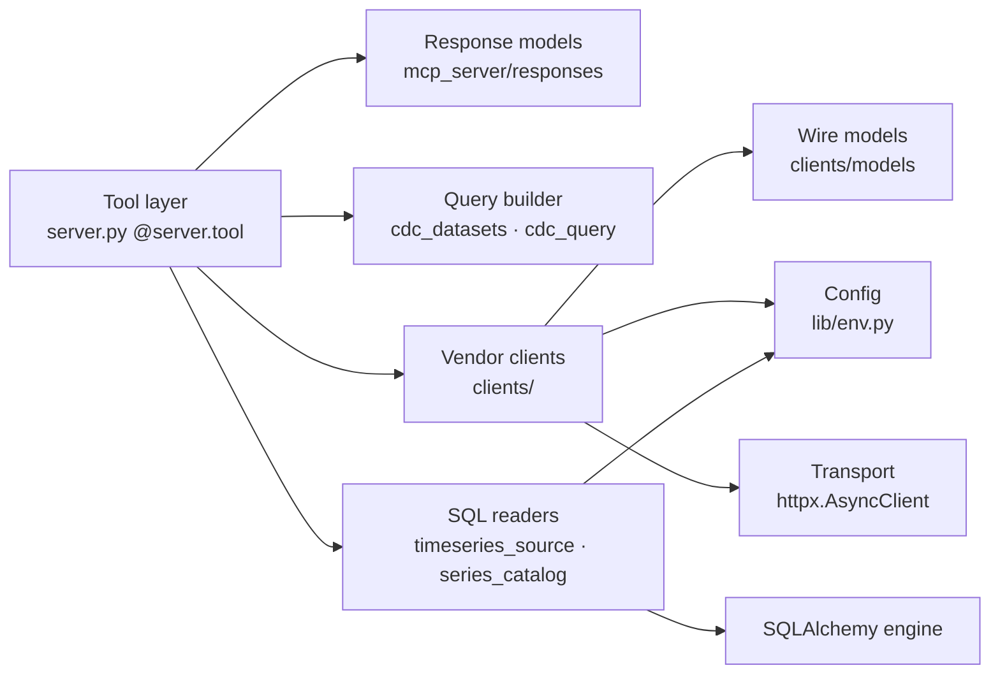
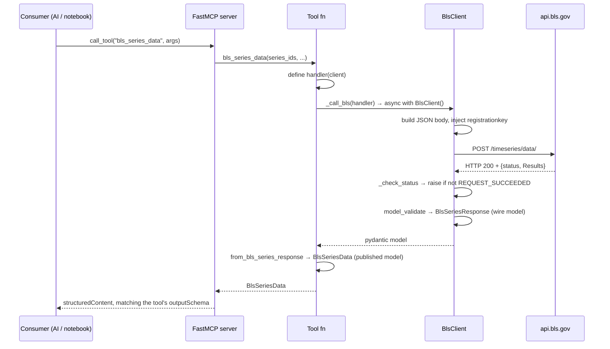
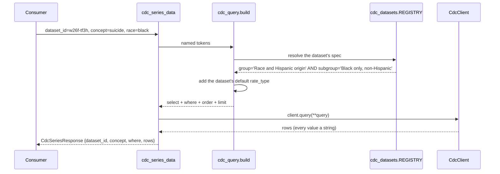

# Architecture

How **meida** is put together: the vendor clients, the MCP server that publishes
them, and the consumers that only ever see tools.

---

## 1. System context

meida is three layers stacked. **Vendor clients** speak each provider's API and
absorb its quirks. The **MCP server** publishes them as 29 tools with real,
typed schemas. **Consumers** — AI assistants and Jupyter notebooks — talk only to
those tools.

**navi** is no longer in the middle of that stack. The vendor clients used to
live in `navi/lib/clients`; they moved into meida because meida was the only
consumer, and shipping them in a library installed into three repos meant a
change made for meida's interface landed in yada's and alef's dependency. What
meida still borrows from navi is `lib.env` (keys, base URLs, the database URL)
and `lib.logger` — genuinely shared — plus, in the notebooks, `lib.mcp_client`
and the plotting stack.



Notebooks reach data **through the MCP server**, not by importing the clients —
they are themselves MCP clients over `lib.mcp_client`, so the server is
dogfooded by the same interface the AI tooling uses. The deliberate exception is
each source's `client.ipynb` (§9), which drops to the vendor client to show what
the server is hiding. Notebooks do import navi's plotting and utility modules
directly.

Two sources have no live API worth calling from a tool handler: CDC **WONDER**
is throttled to roughly one query per 120 seconds behind a bot filter, and CDC
**NVSR** is annual Excel workbooks downloaded by hand. Those are pulled once
into meida's own Postgres and served from there (§10). From outside, the call
looks like any other tool call.

### The tool surface

| Group | Tools | |
| --- | --- | --- |
| FRED | `fred_category_children`, `fred_category_series`, `fred_series_info`, `fred_series_observations`, `fred_series_updates`, `list_releases`, `fred_release_series` | 7 |
| Tiingo | `tiingo_series_info`, `tiingo_price_series` | 2 |
| BLS | `bls_series_data`, `bls_series_latest`, `bls_popular_series`, `bls_all_surveys`, `bls_survey_info` | 5 |
| BIS | `bis_dataflows`, `bis_datastructure`, `bis_series_data` | 3 |
| CDC Socrata | `cdc_discover`, `cdc_categories`, `cdc_tags`, `cdc_dataset_columns`, `cdc_series_data`, `cdc_dataset_facets` | 6 |
| Stored series | `timeseries_source_list`, `timeseries_source_data`, `timeseries_source_stale` | 3 |
| Catalog | `series_catalog_search`, `series_catalog_entry`, `series_catalog_concepts` | 3 |

Every source's tools split the same way: **discovery** (what exists), then
**fetch** (the observations). The last two groups are the exceptions, and they
are the interesting ones — `series_catalog_*` is discovery that spans both
retrieval routes rather than one provider, and `timeseries_source_*` is fetch
with no provider behind it at all.

---

## 2. Repository layout

### meida

| Path | Role |
| --- | --- |
| `mcp_server/server.py` | FastMCP server; all 29 tool definitions |
| `mcp_server/responses/` | meida's own published response models (§6) |
| `mcp_server/cdc_datasets.py` | The CDC query contract: which column and literal back each named facet, per dataset |
| `mcp_server/cdc_query.py` | Turns facet tokens into SoQL; derives the enums the tool advertises |
| `mcp_server/timeseries_source.py` + `_models.py` | Reader for the `time_series_source` table (§10) |
| `mcp_server/series_catalog.py` + `_models.py` | Reader for the `series_catalog` table (§10) |
| `mcp_server/wonder_source.py` | WONDER by concept out of the database; not exposed as a tool |
| `clients/` | Async vendor clients: `fred.py`, `tiingo.py`, `bls.py`, `bis.py`, `cdc.py`, `wonder.py` |
| `clients/models/` | Frozen pydantic models of each vendor's **wire format** |
| `alembic/`, `alembic.ini` | Migrations for the two tables; the URL comes from `get_meida_db_url()` |
| `notebooks/{fred,tiingo,bls,bis,cdc}/` | Three notebooks per source plus a `utils.py` of helpers (§9) |
| `tests/` | 384 tests over the server, the clients, the response models and the SQL readers (§7) |
| `requirements.in` / `.txt` | Runtime deps, pip-compiled; includes `-e ../navi` |
| `requirements-dev.in` / `.txt` | Test-only deps (pytest, pytest-asyncio) |
| `pytest.ini` | `testpaths=tests`, `pythonpath=.`, `asyncio_mode=auto` |
| *(docs)* | In the shared `sefer` repo — see [../README.md](../README.md) |

### navi

| Path | Role |
| --- | --- |
| `lib/env.py` | API keys, base URLs and `MEIDA_DB_URL`, from `navi/.env` |
| `lib/logger.py` | Colorized logger (`get_logger`) |
| `lib/mcp_client.py` | SSE MCP client wrapper (`MCPClient`, `MCPClientConfig`) — how notebooks call the server |
| `lib/plots/`, `lib/utils.py`, `lib/config.py` | matplotlib visualizations, helpers and style — imported directly by notebooks |
| `lib/data/`, `lib/models/`, `lib/stats.py`, `lib/trading/` | ADF, ARIMA, VAR, VECM, ECM, BM, fBM, OU; backtrader metrics. **alef's**, tested in `alef/tests`; meida imports none of it |

navi is installed into meida as an **editable local package** (`-e ../navi`), so
`import lib` resolves live from the sibling checkout. `pyrightconfig.json`
mirrors this with `extraPaths: ["../navi"]`.

navi has no database module. meida owns its Postgres end to end — schema,
migrations, and the readers — so navi stays free of a database dependency.

---

## 3. Layers and dependency direction



Dependencies point one way. Each layer has a single responsibility:

- **Tool layer** — the MCP surface: names, descriptions, parameter defaults and
  enums, and mapping the payload onto a published model. Owns no HTTP or SQL.
- **Response models** — the shape meida publishes, and nothing else (§6).
- **Query builder** — the only place CDC's per-dataset column names and literals
  appear, so no SoQL crosses the wire (§4).
- **Vendor clients** — HTTP mechanics, auth injection, error translation.
- **Wire models** — the vendor's payload shape and validation. No I/O.
- **SQL readers** — the stored-series and catalog queries. Blocking SQLAlchemy
  calls are pushed to a thread so the async handlers are not blocked.
- **Config** — secrets, base URLs, database URL. Read-only, env-backed.

The two fetch routes — HTTP for live sources, SQL for stored ones — converge at
the tool layer. A consumer cannot tell which it got except by which tool it
called, which is the point.

---

## 4. Request flow

### The live route

End-to-end for `bls_series_data`:



The `_call_X(handler)` indirection exists so the tool function owns *what to ask
for* while the helper owns *client lifecycle*. It also makes tools trivially
testable — tests patch `_call_bls` and run the handler closure against a
recording fake (§7). Serialization is no longer the helper's job: each tool
declares a response model as its return annotation, and FastMCP dumps it.

### The CDC facet route

`cdc_series_data` takes **named facets**, not SoQL. The arguments are
`dataset_id`, `concept`, and `state` / `race` / `sex` / `age` / `drug` /
`rate_type` / `period`, plus `year_start` / `year_end` — each a `Literal` that
becomes a JSON Schema `enum`, so a client sees the accepted vocabulary without
reading prose.



That indirection is not ceremony. The same facet is a different column in every
dataset — `race` is the column `race` on `w9j2-ggv5`, the pair
`group`/`subgroup` on `w26f-tf3h`, `stratificationcategory1`/`stratification1`
on `hksd-2xuw` — and a caller cannot be expected to know that, which is exactly
why a raw-SoQL parameter was the wrong interface. The enums are the **union**
across datasets, so a token valid for one is often absent from another;
`cdc_dataset_facets` reports the per-dataset subset, and an unknown token raises
an error naming what *is* valid. The builder also fills in what the caller
didn't say — each dataset's default `rate_type`, its "Overall" stratification
when no breakdown was asked for — and quotes SoQL reserved words such as
`group`. The resolved `where` clause comes back in the response for
provenance — an output, never an input.

Two pivot modes, because CDC datasets come in two shapes. **CROSS** datasets
have independent facet columns and a true Cartesian product (`w9j2-ggv5` race ×
sex). **STRATIFIED** ones publish one active stratification per row, so asking
for age *and* race at once describes a series that was never published, and the
builder refuses rather than returning nothing.

### The stored route

`timeseries_source_data` and the `series_catalog_*` tools do the same dance
against SQLAlchemy instead of httpx: `async with TimeSeriesSourceClient()`, a
blocking query pushed to a thread, and a published model back. No provider is
contacted.

---

## 5. The client pattern

**Five of the six clients** — FRED, Tiingo, BLS, BIS, CDC — share a deliberate
shape:

```python
class XClient:
    def __init__(self, *, api_key=None, base_url=None, timeout=30.0, client=None):
        self.api_key = api_key or get_x_api_key()
        self.base_url = (base_url or get_x_base_url()).rstrip("/")
        self._client = client or httpx.AsyncClient(base_url=..., timeout=...)
        self._owns_client = client is None      # don't close a caller's client

    async def __aenter__/__aexit__/aclose        # async context manager
    async def _get(...)                          # auth injection + error wrapping
    async def get_thing(...) -> TypedModel       # model_validate the payload
```

Two properties matter architecturally:

- **Injectable transport.** The `client=` parameter is what makes the suite
  hermetic — tests pass an `httpx.AsyncClient` backed by `MockTransport`.
  `_owns_client` ensures a caller-supplied client isn't closed underneath them.
  The SQL readers repeat the shape with `engine=` in place of `client=`.
- **Errors are translated at the boundary.** Each client raises its own
  `XAPIError`, so callers never handle raw `httpx` exceptions.

### Provider differences

The abstraction is intentionally thin — the providers genuinely differ:

| Client | Transport | Auth | Payload | Notable |
| --- | --- | --- | --- | --- |
| **FRED** | GET, httpx | `api_key` query param, **required** | JSON | `file_type=json` forced on every call |
| **Tiingo** | GET, httpx | `Authorization: Token` header, **required** | JSON, camelCase | no catalog at all — you arrive knowing the ticker |
| **BLS** | POST (multi-series) + GET, httpx | `registrationkey` in **body**/query, **optional** | JSON in an HTTP-shaped envelope | HTTP 200 on failure; 5xx/transport retried with backoff |
| **BIS** | GET, httpx | **none** | SDMX-JSON for structure, **CSV** for observations | flat rows grouped into series client-side |
| **CDC (Socrata)** | GET, httpx | optional `X-App-Token` | JSON, every value a **string** | two hosts — the portal, plus a cross-domain discovery catalog |
| **CDC WONDER** | POST, **curl_cffi** | none | XML request → XML `<data-table>` | ~1 request/120 s, self-throttled, browser TLS fingerprint |

BLS is the outlier on HTTP semantics. Its client checks
`status != "REQUEST_SUCCEEDED"` and raises even on a 200, while tolerating
advisory `message[]` entries on success (e.g. "Year range has been reduced to
the system-allowed limit of 20 years" is a *warning*, not a failure). It retries
transient failures — connection errors, timeouts, 5xx, unparseable bodies — with
exponential backoff, and never retries a 4xx or a `REQUEST_NOT_PROCESSED`,
because repeating those cannot help.

**`WonderClient` is the outlier on everything else** and is the one client with
no MCP tool behind it. It uses `curl_cffi` rather than httpx (the bot filter
wants a browser TLS fingerprint), takes no `client=` seam, and waits out its own
throttle. Calling it from a tool handler would mean a two-minute request, so it
is used offline by `notebooks/cdc/wonder_series.py` to build the series that
then load into Postgres.

---

## 6. Models

There are **two model layers**, and the boundary between them is the point.

| Layer | Location | Exists to | Shape |
| --- | --- | --- | --- |
| **Wire models** | `clients/models/*.py` | *parse* the vendor | the vendor's spelling via aliases (`seriesID`, `periodName`, `adjClose`, `Results`), the vendor's envelope (`status`, `responseTime`, `realtime_start`), frozen |
| **Response models** | `mcp_server/responses/*.py` | be *published* | snake_case, no aliases anywhere, envelope dropped, dates as ISO strings |

Why the split: pydantic's `model_json_schema()` emits **by alias**, so serving a
wire model straight out of a tool would make Tiingo's `adjClose` and BLS's
`Results` meida's own published contract — sitting beside the snake_case that
`cdc_series_data` and `timeseries_source_data` already use. The wire models have
to keep the aliases to parse at all. So the rule is: **the client layer models
the vendor, the tool layer models the interface.**

Not every source needs a translation:

| Source | Published models | Why |
| --- | --- | --- |
| FRED | full (`responses/fred.py`) | FRED misspells `seriess`; realtime envelope; `date` objects |
| BLS | full (`responses/bls.py`) | `Results` envelope, camelCase keys, observations three levels down |
| Tiingo | full (`responses/tiingo.py`) | camelCase on every field of every price row |
| BIS | pass-through + a list wrapper and a reshaped view | wire models are already snake_case, alias-free, envelope-free |
| CDC Socrata | pass-through + 3 list wrappers | same |
| stored series | `mcp_server/timeseries_source_models.py` | not a vendor payload at all — meida's own shape |
| catalog | `mcp_server/series_catalog_models.py` | same |

Even a pass-through source needs *something*, because a bare list yields no
`structuredContent` at all — hence the list wrappers. `BisDataStructureView` is
its own model for an honest reason: `bis_datastructure` blanks each codelist's
codes unless asked (some exceed 1000 entries) and reports `code_count` instead,
so the response genuinely differs from the wire model. `cdc_series_data` and
`cdc_dataset_facets` declare their models inline in `server.py`, since they
reshape rows rather than map a payload.

Conventions the layers share:

- **Provider quirks are absorbed in the wire models, not in callers.** FRED's
  `last_updated` validator normalizes a short timezone suffix (`-05` → `-0500`)
  and falls back to naive parsing. BLS's `Catalog` sets `extra="allow"` because
  its fields vary per survey. Numeric-looking values that arrive as strings
  (BLS `value` and `year`, every Socrata column) stay strings — vendors return
  strings and callers cast.
- **Observations follow one house shape**, set by `timeseries_source_models`:
  `{"date": "YYYY-MM-DD", "value": "<number as string>"}`, ascending, with the
  row retained so the series calendar stays intact. FRED and BLS map onto it.
  Tiingo is the exception — a day of trading is OHLCV plus its adjusted twin, so
  the row keeps its body, but it still carries a `date` field in the same ISO
  form so a price series aligns with a FRED or BLS one without special-casing.
- **Mappers are pure and total.** `from_*(payload)` performs no I/O, and a
  `None` or empty payload maps to an empty model rather than raising at the tool
  boundary. They read mappings by key as well as by attribute, so a dict that
  misses every `getattr` doesn't map to a silently empty result.

All 29 tools declare a response model as their return annotation, so every one
publishes a real `outputSchema`. Before this package existed, tools were
annotated `Mapping[str, Any]` and advertised `{"result": {"type": "object"}}` —
a consumer was told an object came back and nothing else.

---

## 7. Testing strategy

All tests live in **meida** (`tests/`). **384 tests, ~0.7 s**, no network and no
database required.

| File(s) | Tests | Covers |
| --- | --- | --- |
| `test_responses_{fred,bls,tiingo}.py` | 202 | The published models and their mappers — the largest block, because this is what consumers actually see |
| `test_server.py` | 32 | Per-tool parameter assembly, the incomplete-observations warning, facet→SoQL wiring, rejection of injection through a facet |
| `test_{fred,tiingo,bls,bis,cdc,wonder}_client.py` | 54 | Request construction, auth injection, model parsing, error translation |
| `test_{fred,tiingo,bls,bis,cdc}_models.py` | 34 | Aliases, validators, defaults, immutability |
| `test_{timeseries_source,series_catalog}_client.py` | 26 | The SQL readers — filters, ordering, counting, staleness |
| `test_timeseries_builders.py` | 19 | The WONDER D76/D158 splice and the NVSR table → (race, sex) mapping |
| `test_cdc_catalog.py` | 10 | The catalog registry and build logic in `notebooks/cdc/catalog.py` |
| `test_wonder_source.py` | 7 | Concept → stored identifier, `stored_only` as the default, and that a miss fails loudly instead of reaching for the network |

Three techniques carry the suite:

1. **`httpx.MockTransport`** via the `make_*_client` conftest fixtures. Clients
   take explicit `api_key`/`base_url`, so no keys are needed. The fixtures are
   async so injected transports get closed on teardown.
2. **A SQLite in-memory engine** through the same `engine=` seam for the SQL
   readers — real SQL runs, no Postgres. SQLite covers equality filters,
   ordering, counting and limiting; it cannot cover JSONB containment (`@>`),
   which is the one genuinely Postgres-only path. That is exercised by
   `test_series_catalog_facets` against the live database, skipped when none is
   reachable.
3. **Recording fakes** for tool tests: patch `server._call_bls` (etc.) and run
   the handler closure against a fake client that records calls. This isolates
   argument assembly from the clients entirely.

`tests/fixtures/{bls,bis,cdc}/` are **real responses captured from the live
APIs** — they pin the model layer to reality (they're what revealed BLS's
`Results` is an object, not the array the docs show). They contain no secrets.

---

## 8. Configuration and secrets

`navi/lib/env.py` is the single source of truth. It loads `navi/.env` at import
(overridable with `NAVI_ENV_FILE`), so **both repos share one credentials file**.

| Variable | Default | Notes |
| --- | --- | --- |
| `FRED_API_KEY` | — | required |
| `TIINGO_API_KEY` | — | required |
| `BLS_API_KEY` | — | optional; raises limits, enables `catalog`/`calculations` |
| `CDC_API_KEY` | — | optional Socrata **app token**, not a secret key; only raises rate limits |
| `FRED_BASE_URL` | `https://api.stlouisfed.org/fred` | |
| `TIINGO_BASE_URL` | `https://api.tiingo.com/tiingo` | |
| `BLS_BASE_URL` | `https://api.bls.gov/publicAPI/v2` | |
| `BIS_BASE_URL` | `https://stats.bis.org/api/v1` | no credentials exist for BIS, so there is no key accessor |
| `CDC_BASE_URL` | `https://data.cdc.gov` | the portal; discovery uses `api.us.socrata.com` and is not configurable |
| `MEIDA_DB_URL` | `postgresql+psycopg://meida@localhost/meida` | read by the SQL readers *and* by `alembic/env.py` |
| `MCP_URL` | `http://localhost:8080/sse` | used by notebooks |

The required-key lookup is `lru_cache`d and raises a descriptive error naming
the `.env` path when a key is missing. `get_bls_api_key(required=False)` and
`get_cdc_api_key()` return `None` instead — the two accessors that tolerate
absence, because both providers answer without a key. WONDER has no
configuration at all: its endpoint is hard-coded and it takes no credential.

---

## 9. Notebooks, discovery, and generated data

Each source has the **same trio** of notebooks, plus a `utils.py` of helpers,
and a fourth for sources that are downloaded rather than queried:

| Notebook | What it does |
| --- | --- |
| `mcp.ipynb` | Exploration through the server — what tools exist, their schemas, example calls |
| `walkthrough.ipynb` | The narrative arc: discovery → fetch → plot, entirely over MCP |
| `client.ipynb` | The *same* arc against the vendor client, with no server in the middle |
| `downloads.ipynb` | **File-delivered sources only** — how the raw files are fetched |

### `downloads.ipynb` — the pattern for file-delivered sources

A source with no live API has to be pulled in bulk and parsed from disk, and
those pulls are slow, rate-limited, or both: CDC's is ~15 minutes of FTP for
936 workbooks plus ~40 minutes of WONDER at one query per two minutes. That
changes what the code around it has to do.

**A notebook rather than a script**, for two reasons. The saved cell output is
the record that an expensive pull succeeded and what it produced — `153
wanted, 0 downloaded, 153 on disk` is worth more than the absence of an error.
And a notebook makes re-running deliberate; a script is one stray `python
fetch.py` away from re-pulling against a host that blocks aggressive access.
The download functions themselves live in a plain `fetch.py` beside it, so
they are importable and testable; the notebook only drives them.

Four properties every such fetcher needs, all learned by getting them wrong:

- **Idempotent.** Anything already on disk is skipped, so an interrupted pull
  resumes instead of restarting. Both of CDC's pulls stalled part-way.
- **Paced for a rate-based filter.** `ftp.cdc.gov` does not reject the first
  fast request — it serves ~400 files and then times out every read after
  that. `curl_cffi` with a browser fingerprint plus a 1s pause, and a test
  asserting nobody lowers it.
- **Records what it could not get.** WONDER rejects codes that are part of the
  published definitions; the fetcher drops what the error names, retries, and
  writes `dropped_codes` into a summary the builders read. Without it the
  series quietly misrepresent their own definition.
- **Verified before the data is trusted.** A truncated workbook still parses —
  it returns a wrong number. `verify_national` / `verify_state` run over
  everything on disk and raise rather than emitting quietly-wrong series.

Sources using it today: **CDC** (NVSR life tables, WONDER cause-of-death
rates). Sources fetched live from an API do not need one.

`client.ipynb` earns its place by being redundant: running both is how you see
what the server translates. Tiingo's wire format is camelCase and its client
carries those as aliases; the MCP tool returns `adj_close` / `div_cash` /
`split_factor`. It also has a different operational cost — the client notebooks
need the vendor credential but not a running server, and BIS's needs neither.

Anything else in a source's directory is a **discovery pipeline** — the
notebooks and modules that pull catalog metadata down to local YAML. FRED walks
its category tree in `categories/` and `series/`, BLS has `surveys.ipynb`, and
CDC carries the largest set (`catalog.py`, `discovery.ipynb`, `wonder.ipynb`,
`downloads.ipynb`, and the builders; the loaders are shared, in `db_import/`).
Those outputs are **git-ignored and regenerable**, and the sizes are why — the
four catalogs come to roughly 380 MB on disk, none of it in the repo. The one
exception is the normalized `.jsonl`, committed because NCHS revises published
data in place — see [conventions](../conventions.md).

| Source | Discovery model | Output (ignored) | Size |
| --- | --- | --- | --- |
| FRED | Category tree walk from the top-level categories → leaf categories → series per leaf | `notebooks/fred/{categories/category_data,series/series_data}/` | 206 MB |
| BLS | Flat-file catalog from `download.bls.gov` → survey + series metadata | `notebooks/bls/data/` (catalog), `notebook_downloads/` (raw files) | 148 MB, 288,085 series |
| BIS | SDMX structure resources + one bulk pull per dataflow for coverage dates | `notebooks/bis/data/` | 18 MB, 26,902 series across 22 dataflows |
| CDC | Hand-written registry of curated datasets → facet cross-product per dataset, plus the NVSR/WONDER downloads (§9) | `notebooks/cdc/data/` | 25 MB, 2,526 catalog entries |

For **BLS** the catalog is built from the **flat files**, not the API — the API
can only enumerate ~25 popular series per survey and lacks coverage dates. The
result is a **survey/series** metadata model (`survey.yaml` plus one
`bls_series_<CODE>.yaml` per survey, 23 files: 22 economic surveys and a
filtered OE occupation slice), the analog of FRED's category/series with faceted
classification instead of a category path. Two operational notes: the fetch
needs `curl_cffi` to pass BLS's bot filter, and observations are fetched from
the API separately — the catalog is metadata only. See [api/bls.md](api/bls.md).

**BIS** needs no credentials and has no series ids — a series has *coordinates*,
a dot-joined key in DSD dimension order. The catalog therefore has to carry the
decoded dimension labels as well as the key. See [api/bis.md](api/bis.md).

**CDC** cannot be enumerated: it is one Socrata API over a large, open-ended set
of datasets with inconsistent schemas, so six useful ones are **curated** in
`mcp_server/cdc_datasets.py` rather than discovered.
`notebooks/cdc/catalog.py` imports that same registry to generate the catalog,
which keeps the tool's accepted vocabulary and the catalog's `facets` metadata
keys identical by construction. `catalog_timeseries.py` does the same for the
two file-delivered sources, `descriptions.py` adds LLM-generated prose for the
document store, and `load_catalog.py` / `load_timeseries.py` put the results in
Postgres — the 2,502 Socrata entries plus 180 stored ones are the 2,682 rows
`series_catalog` holds. See [api/cdc.md](api/cdc.md) and
[api/wonder-nvsr.md](api/wonder-nvsr.md).

---

## 10. The two Postgres tables

meida owns a small database — schema, migrations (`alembic/`), readers, and the
tools over them. It exists for two different reasons, one per table.

### `time_series_source` — observations that cannot be fetched per request

Two CDC sources make live fetching impossible: **WONDER** is throttled to
roughly one query per 120 seconds behind an Akamai bot filter, and **NVSR** is
annual life tables as Excel workbooks on an FTP tree with no programmatic year →
volume mapping. Their observations are pulled once and stored here, so this
table is **not a cache — it is the source of truth** for these series. Read by
`TimeSeriesSourceClient`, served by `timeseries_source_list`,
`timeseries_source_data` and `timeseries_source_stale`. It currently holds 180
series: 171 NVSR, 9 WONDER.

**Expiry means "due for a refresh", never "withhold".** `expires_at` here says
when someone should go re-run the throttled WONDER pull or look for a new NVSR
volume. Reads flag staleness and return the data anyway — annual data three
weeks late is fine where a missing series is not. This is the one semantic that
differs from yada's cache, whose columns the table otherwise mirrors so that
moving a series across is a straight copy. See
[time-series-source.md](time-series-source.md).

`WonderSourceClient` (`mcp_server/wonder_source.py`) is a thin layer on top that
looks a series up **by concept** rather than by native id, with
`stored_only=True` by default: a miss raises, naming the concepts that *are*
available, instead of silently costing two minutes and a request against a rate
limit nobody wants to spend. It has no MCP tool — notebooks and tests are its
consumers.

### `series_catalog` — which series exist, and what fetches them

Discoverability. Before it, the two halves of the server were asymmetric:
`timeseries_source_list` could enumerate the stored series, but nothing could
enumerate the 2,346 live Socrata ones — they were fetchable only if you already
knew their facets, and the catalog YAML that knows they exist is gitignored
build output that no runtime code reads.

Each row carries a **`retrieval` block naming its fetch tool**, which is what
lets one listing span both routes. Of the 2,682 rows today, 2,346 point at
`cdc_series_data` (live Socrata), 180 at `timeseries_source_data` (stored), and
156 at nothing — state-level life-expectancy snapshots that are a multi-query
union with no single-call route. A row's `facets` keys are exactly the arguments
`cdc_series_data` takes, so a value read off a discovered series passes straight
back in.

Served by `SeriesCatalogClient` via `series_catalog_search`,
`series_catalog_entry` and `series_catalog_concepts`. Search is **exact, not
fuzzy**: descriptions are generated per *bucket* of series that differ only by
facet value — 1,014 `alcohol_binge` series share four description strings — so
free-text ranking cannot separate them and facet filtering is the only thing
that can. Semantic search over those descriptions is yada's document store's
job; this is the exact-match index underneath it. JSONB containment (`@>`) over
`facets` is the main search path, which is why that column carries a GIN index.

The table is deliberately **not CDC-specific**: `source` namespaces rows the
same way it does in `time_series_source`, so the BIS and BLS catalogs can load
into it later without a migration.

---

## 11. Known inconsistencies

Worth knowing before extending; none are currently breaking.

- **Tool naming.** `list_releases` lacks the `fred_` prefix used by every other
  FRED tool.
- **BLS docs vs reality.** BLS documents `Results` as an array; the live API
  returns an object. The models follow reality — see [api/bls.md](api/bls.md).
- **Stale "navi" references in code comments.** `clients/bls.py` still names its
  logger `navi.clients.bls`, and the docstrings in `mcp_server/responses/`
  describe the wire models as "navi's" — they moved into `meida/clients/models`,
  so the reason for the split is now a layer boundary inside meida rather than a
  repo boundary. The reasoning still holds; the location in the prose does not.
- **156 catalog rows have no fetch tool** (`retrieval.tool` is null) — the
  state-level life-expectancy snapshots. They are discoverable but not
  retrievable in one call.
- **`navi/.env.example` is behind `lib/env.py`.** It documents FRED, BLS,
  Tiingo and `MCP_URL`, but not `BIS_BASE_URL`, `CDC_API_KEY`, `CDC_BASE_URL`
  or `MEIDA_DB_URL` — a new checkout gets the defaults and has to find the rest
  by reading the accessors.

---

## 12. Adding a new data source

The CDC integration is the current reference implementation, and the BLS one is
the simplest. Order matters — explore before you model.

1. **Explore.** Hit each endpoint once, capture real responses as fixtures. Do
   not model from documentation alone.
2. **Config.** Add `get_x_api_key()` / `get_x_base_url()` to `navi/lib/env.py`
   plus entries in `.env.example`.
3. **Wire models.** `clients/models/x.py` — frozen, aliased, tolerant where the
   provider is inconsistent.
4. **Client.** `clients/x.py` — the §5 shape, with an `XAPIError`. Export it
   from `clients/__init__.py`.
5. **Response models.** `mcp_server/responses/x.py` — snake_case, no aliases,
   envelope dropped, observations in the house shape. Skip only if the wire
   models are already clean, and even then you need list wrappers.
6. **Tools.** Add `_call_x` and `@server.tool` functions in
   `mcp_server/server.py`, each annotated with its response model.
7. **Tests.** `tests/test_x_client.py` + `test_x_models.py` against the captured
   fixtures, `test_responses_x.py` for the mappers, and tool tests in
   `test_server.py`.
8. **Discovery.** `notebooks/x/utils.py` + the `mcp`/`walkthrough`/`client`
   trio; git-ignore the data dirs.
9. **Catalog.** If the source is enumerable, load it into `series_catalog` under
   its own `source` namespace so it joins the one listing.
10. **Docs.** Update the README and add a reference doc under `api/`.

---

## 13. Runtime

```bash
python -m mcp_server.server      # FastMCP, SSE, 0.0.0.0:8080 → /sse
pytest tests                     # 384 tests, no network
alembic upgrade head             # the two tables; URL from get_meida_db_url()
```

The server must be run **as a module**, not as a script — `server.py` uses
relative imports, so `python mcp_server/server.py` fails on
`ModuleNotFoundError: No module named 'clients'`.

`.vscode/launch.json` provides debugpy configurations for both ("Run MCP server
(sse)" and "Run tests (pytest)"). The server is single-process and stateless —
every tool call constructs a fresh client and closes it, whether that is an
`httpx.AsyncClient` or a SQLAlchemy engine, so there is no connection pooling or
shared session across calls.
