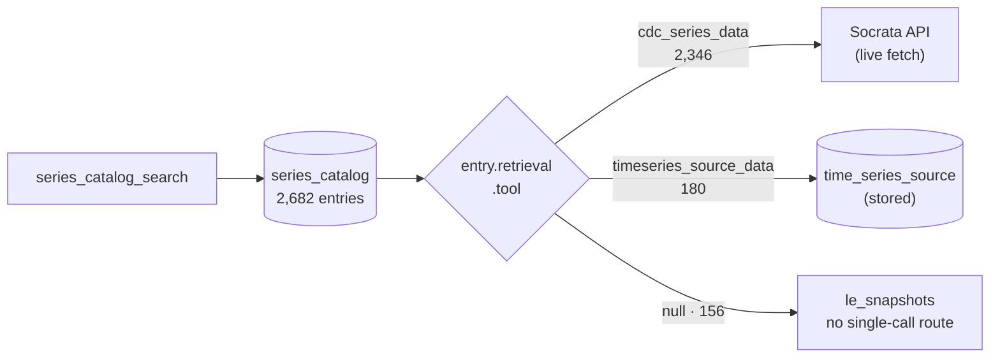

# meida Series Catalog

> **Status: built** (2026-09-07). Migration `8f31c0a4e7d2` is applied, the client
> is `mcp_server/series_catalog.py`, and three MCP tools serve it. 2,682 entries
> are loaded, all under `source = "cdc"`.

The discovery half of meida's database.
[`time_series_source`](time-series-source.md) answers *"give me this stored
series"*; `series_catalog` answers **"which series exist, and what fetches
them"** — for every series meida can serve, whichever route serves it.

Companion to [time-series-source.md](time-series-source.md) and the
[CDC reference](api/cdc.md), which covers how the catalog is *generated*. This
doc covers where it lands and how it is read.

## The problem: the two halves were asymmetric

Before this table, meida could enumerate exactly one of its two kinds of series.

| | Stored series (WONDER, NVSR) | Socrata series |
| --- | --- | --- |
| Fetch | `timeseries_source_data` | `cdc_series_data` |
| Enumerate | `timeseries_source_list` — 180 series | **nothing** |

The Socrata half was reachable *only if you already knew its facets*. You could
ask for `chronic_liver_mortality` in Texas, age-adjusted — but only because you
had somehow learned that those were the right words, that a
`chronic_liver_mortality` concept existed at all, and that it was published for
Texas. `cdc_discover` searches CDC's **dataset** portal, which is a different
question: it finds the datasets, not the 2,502 series inside them.

The thing that *did* know all 2,502 existed was the exported catalog YAML under
`notebooks/cdc/data/` — [gitignored, regenerable build
output](../conventions.md) that **no runtime code read**. On a clean checkout it
does not exist at all. So the knowledge was real, written down, and unreachable
from the server.

Loading it into a table fixes that, and does one thing more: because the stored
series go into the same table, a **single listing spans both routes**. A caller
asks "what life-expectancy series exist?" once and gets all 336 back together —
171 stored NVSR series, 156 Socrata state snapshots, and 9 long-history series
from `w9j2-ggv5` — each carrying instructions for its own fetch.

## `series_catalog`

Deliberately **not** CDC-specific. `source` namespaces rows the same way it does
in `time_series_source`, so the BIS and BLS catalogs can load here later without
a migration.

| Column | Type | Notes |
| --- | --- | --- |
| `catalog_id` | uuid PK | `gen_random_uuid()`. |
| `source` | text | Catalog namespace — `cdc` today. |
| `series_id` | text | e.g. `cdc/alcohol_binge/hksd-2xuw/state=ak/race=aian/age_adjusted`. |
| `dataset_id` | text, null | Provider dataset. Null for the stored series and the `le_snapshots` union. |
| `concept` | text, null | What is measured — `alcohol_binge`, `suicide`, `life_expectancy`. |
| `title` | text | Formulaic, and **the discriminating field**: 2,676 distinct across 2,682 rows. |
| `description` | text, null | LLM-generated **per bucket** — 38 distinct strings across 2,682 rows. |
| `units` | text, null | |
| `frequency` | text, null | |
| `provisional` | boolean | Revised in later releases (VSRR counts). 442 rows. |
| `is_active` | boolean, null | Still being updated, judged **per vintage** so provisional data does not make final data look stale. 1,511 rows. |
| `facets` | jsonb | The values that pick this series out of its dataset. |
| `retrieval` | jsonb | Which tool fetches it, and with what. |
| `observation_start` / `observation_end` | date, null | Coverage bounds. |
| `created_at` / `updated_at` | timestamptz | `now()` defaults. |

**Unique `(source, series_id)`** — the upsert conflict target. B-tree indexes on
`source`, `concept`, `dataset_id` and `is_active`; a **GIN index on `facets`**,
because containment (`"every series with state=TX"`) is the main search path and
JSONB needs GIN for `@>` to use an index at all.

`facets` earns its own note: its keys are **exactly the argument names
`cdc_series_data` takes** — `state`, `race`, `sex`, `age`, `drug`, `rate_type`,
`period`. A block read out of a search result can be passed straight back into a
fetch, with no translation step in between and nothing for a caller to guess.

### The `retrieval` block

This is the field that makes one listing serve two routes. Every row names the
tool that fetches it:

```jsonc
// Socrata — derived at load time from what a cdc_series_data call needs
{"tool": "cdc_series_data", "dataset_id": "489q-934x",
 "concept": "chronic_liver_mortality",
 "facets": {"rate_type": "age_adjusted", "period": "12mo_ending"}}

// stored — written by catalog_timeseries.py, pointing into time_series_source
{"tool": "timeseries_source_data", "source": "cdc_nvsr",
 "native_id": "cdc/life_expectancy/nvsr/race=aian_nh/sex=both"}
```



The three outcomes, all verified against the live table:

| `retrieval.tool` | Rows | What it is |
| --- | --- | --- |
| `cdc_series_data` | 2,346 | Live Socrata fetch. |
| `timeseries_source_data` | 180 | The stored series — 171 NVSR, 9 WONDER. |
| `null` | 156 | The `le_snapshots` group: state life expectancy assembled from four single-year datasets, so it needs several sub-queries unioned and has no single-call route yet. |

That last row is why `retrieval.tool` is nullable rather than assumed present. A
null is an honest answer — *this series exists, and there is no one call that
gets it* — which is strictly better than a recipe that fails when replayed.

### Why search is exact, not semantic

Because the prose cannot tell these series apart, and the facets can.

Descriptions are generated **one LLM call per bucket** of series that differ only
by facet value — 2,682 series collapse into ~38 `(group, concept, facet-shape,
unit)` buckets. That is deliberate and correct: within a bucket the series really
do describe the same thing, and the per-series distinctions are already in
`facets`. But it means free-text ranking has almost nothing to rank.

| Concept | Series | Distinct descriptions |
| --- | --- | --- |
| `alcohol_binge` | 1,014 | 4 |
| `chronic_liver_mortality` | 757 | 7 |
| `drug_overdose` | 431 | 4 |
| `life_expectancy` | 336 | 4 |
| `suicide` | 77 | 11 |

A thousand-and-fourteen `alcohol_binge` series share four description strings. No
similarity score over that text can pick out the one for adults aged 35–44 in
Texas — every candidate is a literal tie. `facets` is the only thing that
separates them, so the search is built on exact filters and JSONB containment.

This is not an argument against semantic search; it is an argument about where it
belongs. Embedding the descriptions is **yada's document store's job**, and the
descriptions were written for it. `series_catalog` is the exact-match index
underneath — the thing that answers "and now give me precisely that one".

## The client

`SeriesCatalogClient`, in `mcp_server/series_catalog.py`, follows
`TimeSeriesSourceClient` exactly: an injectable `engine=` seam, lazy reflection
so constructing a client needs no database, and blocking SQLAlchemy calls pushed
into `asyncio.to_thread`. Errors translate to `SeriesCatalogError`.

```python
async def search(*, source=None, dataset_id=None, concept=None, facets=None,
                 active_only=False, limit=50) -> tuple[list[CatalogEntry], int]
async def get(series_id, source="cdc") -> CatalogEntry
async def concepts(source=None) -> list[dict]
```

Two decisions worth keeping:

- **`search` returns the total alongside the page**, counted *before* the limit
  is applied. Without it a caller cannot tell "three series exist" from "the
  first three of nine hundred" — which is the difference between a finished
  answer and a misleading one.
- **`limit` is clamped to `MAX_LIMIT = 200`.** A facetless query would otherwise
  hand an entire 2,682-row catalog to a model's context window.

Models are in `mcp_server/series_catalog_models.py`: `CatalogEntry`,
`CatalogSearchResult` (`total`, `returned`, `entries`), `CatalogConcept` and
`CatalogConceptList`. As with the stored-series listings, the list wrappers exist
because FastMCP builds a tool's output schema from its return annotation and a
bare list yields no `structuredContent`.

**Testing** (`tests/test_series_catalog_client.py`, 13 tests): the same SQLite
in-memory engine as the stored-series client, which covers the equality filters,
ordering, counting and limiting. It cannot cover JSONB containment — the one
genuinely Postgres-only path — so `test_series_catalog_facets` exercises that
against the live database and **skips when none is reachable**, keeping the
default suite hermetic.

## The MCP tools

| Tool | Returns | Notes |
| --- | --- | --- |
| `series_catalog_concepts` | `CatalogConceptList` | The coarse map: concept × dataset with a series count. Start here. |
| `series_catalog_search` | `CatalogSearchResult` | Exact filters — `dataset_id`, `concept`, `facets`, `active_only`. |
| `series_catalog_entry` | `CatalogEntry` | One entry by `series_id`. |

`series_catalog_concepts` reports a concept **once per dataset**, not once
overall — `suicide` appears under `9j2v-jamp` (history, 1950–2018), `w26f-tf3h`
(current) and `489q-934x` (VSRR provisional), and those are genuinely different
series with different coverage and vocabularies. Collapsing them would hide the
choice a caller has to make.

The intended arc is `concepts → search → the tool named in retrieval`: pick a
concept from the map, narrow by facets, then fetch with whatever the entry says
fetches it. `notebooks/cdc/walkthrough.ipynb` runs that arc end to end against
the server.

## Loading

`notebooks/cdc/load_catalog.py` reads every `data/cdc_series_*.yaml` and upserts
on `(source, series_id)`, leaving `catalog_id` and `created_at` alone so a
re-export does not break references or reset provenance. Socrata entries get
their `retrieval` block derived here — from the dataset and facets a
`cdc_series_data` call actually needs — while the stored entries already carry an
explicit one from `catalog_timeseries.py`.

**It prunes, and the [stored-series loader](time-series-source.md#loading) does
not.** The difference is what each input file claims to be. A `.jsonl` of
observations is *one pull* — a series missing from it means "not re-pulled". The
catalog export is rewritten **whole** every time, so a series missing from it has
genuinely gone away, and leaving the row behind would leave an orphan promising
data the fetch tools cannot serve. `load()` returns `{"written": …, "pruned": …}`
and takes `prune=False` for the case where you are loading a partial catalog on
purpose.

## The catalog is build output

Worth stating plainly, because the table can make it look otherwise: the YAML
under `notebooks/cdc/data/` is **gitignored, regenerable, and never committed**
([conventions](../conventions.md)). This table is a *load* of that build output,
not a second source of truth for it.

Practical consequences:

- **A clean checkout has no catalog.** The files must be regenerated
  (`catalog.py` / `catalog_timeseries.py`, driven from `catalog.ipynb`) before
  `load_catalog.py` has anything to read — it raises `FileNotFoundError` naming
  the directory rather than silently loading zero rows.
- **Never hand-edit a row.** The next export overwrites it, and prune deletes it
  if the export no longer produces it. Corrections belong in the generator.
- **Descriptions are the exception, and are protected accordingly.** They cost
  LLM calls, so they live in a `descriptions.yaml` sidecar keyed by bucket and are
  merged in at export time — regenerating the catalog needs no API key and cannot
  silently drop them.

## Counts

Everything above was verified on 2026-09-07 by querying the live `meida`
database, not by reading the loader or the YAML.

| Cut | Count |
| --- | --- |
| Total entries | 2,682 |
| Socrata (`cdc_series_data` route) | 2,346 |
| Socrata with no single-call route (`le_snapshots`) | 156 |
| Stored (`timeseries_source_data` route) | 180 |
| Distinct datasets | 6, plus null |
| Distinct concepts | 13 |
| Distinct descriptions | 38 |
| Active | 1,511 |
| Provisional | 442 |

The 2,502 Socrata entries match the group table in
[api/cdc.md](api/cdc.md#series-catalog-built) exactly; the extra 180 are the
stored series, which that generator does not produce.
