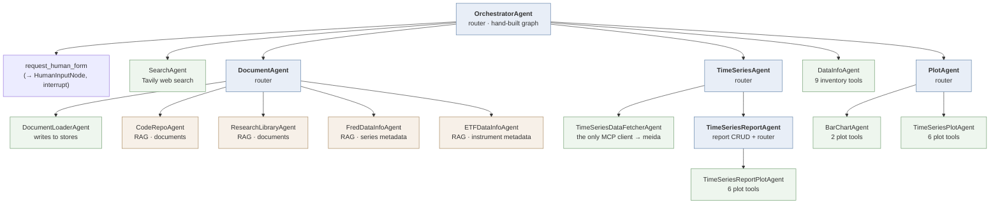

# yada MCP migration plan

**Status:** in progress — branch `mcp-migration`. This section documents the architecture as it
exists today; the target design follows in later sections.

The migration replaces yada's LangGraph orchestrator with a **client-side agent** running in an
MCP client (Goose), exposes the remaining capabilities as **MCP servers**, and adds servers that
return **UI elements** as MCP Apps. Nothing below describes that target. It describes what is
being migrated *from*, because the shape of the current tree determines what each piece becomes.

Verified against the code on 2026-10-03. Where this contradicts `sefer/yada/architecture.md`,
see §4.

---

## 1. Agent tree

Sixteen concrete agents over four base classes. A single orchestrator receives every
conversational request and delegates; each delegate invokes its sub-agent with fresh state and a
new thread id, then returns the sub-agent's final message.



Bold nodes are **routers** — they own no domain tools, only delegates. Green are **leaves**: they
invoke no further agent and are therefore the natural MCP tool boundaries. Amber are **RAG
agents**, which are not ReAct loops at all (§3).

---

## 2. What each agent does

| Agent | File | Role |
| --- | --- | --- |
| **OrchestratorAgent** | `agents/orchestrator.py:334` | Routing only. Classifies the request, calls one or more delegates, returns their output **verbatim**. |
| **SearchAgent** | `agents/search_agent.py:9` | Web search. A stock ReAct loop with one Tavily tool. The only agent reaching outside the local stores and meida. |
| **DocumentAgent** | `agents/document/document_agent.py:263` | Router for all document loading and document search. Five delegates, no tools of its own. |
| **DocumentLoaderAgent** | `agents/document/document_loader_agent.py:112` | The only **writer**: indexes research markdown, clones and indexes GitHub repos, loads or wipes-and-reloads the ETF collection. |
| **CodeRepoAgent** | `agents/document/code_repo_agent.py:14` | RAG over indexed GitHub source — code, READMEs, docs, commit messages. |
| **ResearchLibraryAgent** | `agents/document/research_library_agent.py:24` | RAG over the research library: markdown notes, papers, blog posts. |
| **FredDataInfoAgent** | `agents/document/fred_data_info_agent.py:14` | RAG over **series metadata**, not documents — one synthesized card per FRED series, to find `series_id`s. |
| **ETFDataInfoAgent** | `agents/document/etf_data_info_agent.py:32` | RAG over **instrument metadata** — one card per ETF/fund (~36k from FinanceDatabase), to find tickers. |
| **DataInfoAgent** | `agents/data/data_info_agent.py:197` | "What do I already have?" Inventory across the Postgres series and report caches, repos on disk, research-library metadata. Nine tools, no vector search. |
| **TimeSeriesAgent** | `agents/time_series/time_series_agent.py:115` | Router: splits raw data fetching from report operations. |
| **TimeSeriesDataFetcherAgent** | `agents/time_series/time_series_data_fetcher_agent.py:14` | **The only agent that talks to meida over MCP.** Fetches FRED/Tiingo observations into `SeriesCache` and returns a compact `SeriesRef`. |
| **TimeSeriesReportAgent** | `agents/plots/time_series_report_agent.py:120` | Report CRUD — a report is a named, dated group of `cache_id`s — plus delegation of report plotting. |
| **TimeSeriesReportPlotAgent** | `agents/plots/time_series_report_plot_agent.py:312` | Renders report plots: batches series into groups of ≤5, picks plot type from units. |
| **PlotAgent** | `agents/plots/plot_agent.py:86` | Router between bar charts and ad-hoc time-series plots. Report plots do **not** come here. |
| **BarChartAgent** | `agents/plots/bar_chart_agent.py:53` | Bar charts from inline categorical data, with markdown commentary. |
| **TimeSeriesPlotAgent** | `agents/plots/time_series_plot_agent.py:106` | Ad-hoc time-series charts, from a cached `SeriesRef` or inline arrays. |

Base classes: `ReactAgent` (`core/agents/react_agent.py:16`), `LinearAgent`
(`core/agents/linear_agent.py:8`, sole subclass `TimeSeriesDataFetcherAgent`), `ChromaRAGAgent`
(`core/agents/chroma_rag_agent.py:45`) and `FileChromaRAGAgent`
(`core/agents/file_chroma_rag_agent.py:13`).

---

## 3. Facts that shape the migration

**The orchestrator is not a stock ReAct agent.** It overrides `_create_agent()`
(`orchestrator.py:354`) to hand-build a `StateGraph` with four nodes — `model`, `tools`,
`human_input`, `passthrough` — and its own three-way conditional edge `route_model`
(`orchestrator.py:377`). Both `route_model` and `passthrough` are closures nested inside
`_create_agent`, so neither can be imported or reused as written.

**It deliberately does not synthesize.** The `passthrough` node (`orchestrator.py:386`) discards
the router model's own prose and emits the sub-agent tool output verbatim, via
`assemble_delegate_output` (`orchestrator.py:54`, the one module-level piece and the only one
under test). This exists to stop the router reformatting HTML and image payloads. **A client-side
agent will do the opposite by default** — this is the single biggest behavioural difference the
migration has to confront.

**State is only a message list.** `WorkerState` (`core/agents/messages.py:61`) is a TypedDict with
exactly one field, `messages`. No scratchpad, no typed artifacts. Persistence is a SQLite
checkpointer (`core/checkpointer.py:10`, assigned `:62`) keyed by the HTTP `session_id`.

**Sub-agents are stateless between turns.** Every delegate mints a fresh `thread_id`
(e.g. `orchestrator.py:158`), so no sub-agent sees its own history. Only the orchestrator has
continuity — which means the conversation lives entirely at the layer being replaced.

**yada is an MCP client, not a server.** It exposes no MCP server anywhere. Exactly one agent
consumes meida's tools: `TimeSeriesDataFetcherAgent`, whose `_mcp_tool_names`
(`time_series_data_fetcher_agent.py:21-26`) is the only non-empty binding list in the repo. The
orchestrator itself binds **zero** MCP tools.

**Routing is held together by very large tool descriptions.** `delegate_to_data_info_agent`
carries 1,847 characters / 253 words of description with nine positive and one negative example,
plus pronoun mapping and an inline output rule. `delegate_to_time_series_agent` encodes
cross-tool ordering as `requires_context` entries. This prompt mass is what currently makes
routing work, and it does not transfer to an MCP tool list unchanged.

**The RAG agents are a different topology.** The four `ChromaRAGAgent` subclasses do not run a
ReAct loop; `_create_agent` builds `START → retrieve → grade → generate → END`
(`chroma_rag_agent.py:255-276`), costing two LLM calls per search. `FredDataInfoAgent` and
`ETFDataInfoAgent` go further and use **no generation LLM at all** — their `_generate` is
deterministic string assembly.

**Plots return HTML image tags.** Fourteen sites wrap a file path in ``:
`bar_chart_agent.py` ×2, `time_series_plot_agent.py` ×6, `time_series_report_plot_agent.py` ×6.
This is why the orchestrator must pass output through verbatim, and it is the piece that MCP Apps
replaces.

### Entry points

The orchestrator is the only root of the agent tree, but it is one of **four doors** into yada's
capabilities:

| Door | Route | Cost |
| --- | --- | --- |
| **Agent** | `POST /api/request/stream`, `POST /api/request/resume` | full tree |
| **Retriever** | `GET /api/series/search` → `search_series_rows` (`api/main.py:588`) | constructs a `*DataInfoAgent` but runs **only** `.retriever.ainvoke` — the graph never executes |
| **Plot** | `POST /api/reports/{id}/plot` → `render_report_plot` | zero LLM |
| **Data** | `POST /api/series/fetch`, report CRUD | zero LLM |

Doors 2–4 are already MCP-tool-shaped: they are deterministic, well-specified calls the client
could make directly. `POST /api/request` (`api/main.py:132`) has **no caller** — the UI uses only
the streaming variant.

---

## 4. Corrections to `sefer/yada/architecture.md`

The existing §4 agent tree is accurate in shape — all fifteen edges are real — and its router-model
list (`architecture.md:220-221`) is exactly right. Four things are stale or misleading:

- **Tool count.** `architecture.md:36` says meida exposes 29 tools; `sefer/planning/mcp-integration.md:3`
  says 32 over eight sources, verified 2026-09-27. `sefer/meida/architecture.md:32` also still says 29.
- **Class names.** The code is `ChromaRAGAgent` and `ETFDataInfoAgent`, not `ChromaRagAgent` /
  `EtfDataInfoAgent`.
- **`FileChromaRAGAgent` is undocumented** despite being the base of two of the four RAG agents.
- **The diagram hides the RAG topology**, drawing those four as ordinary children when they are a
  different graph shape with a different cost profile.

---

## 5. Decisions

### 5.1 `SearchAgent` is retired, not ported

Web search moves to the client, at **zero configuration cost**. Goose ships a bundled **skill**,
`web_search.md` (`name: web-search`), served by the `skills` platform extension:

> Search the web and extract page content using DuckDuckGo (no API key required), Tavily, or
> SearXNG. […] Pick the first available: Tavily if `TAVILY_API_KEY` is set, SearXNG if
> `SEARXNG_URL` is set, otherwise DuckDuckGo.

`skills` is enabled by default and the DuckDuckGo path needs no key, so this **already works** —
verified 2026-10-03 by a live query in Goose. The agent (`agents/search_agent.py:9`), its Tavily
dependency and its `delegate_to_search_agent` wrapper all disappear, and the tool surface loses
one entry. No extension needs enabling.

Tavily remains available as a **quality upgrade**, not a requirement: the skill prefers it when
`TAVILY_API_KEY` is present — the same backend and the same key yada uses today (`yada/.env`).
Because the skill *shells out* rather than calling an API from compiled code, the key must be in
Goose's own **process environment**; builtin and platform extensions take no `envs` block
(`ExtensionConfig::Builtin` has 6 fields, only `Stdio`/`StreamableHttp` carry `envs`/`env_keys`),
so there is no config.yaml route. On macOS a Dock-launched Goose does not read shell profiles,
so it needs `launchctl setenv`, a LaunchAgent, or launching the binary from a prepared shell.

**Resolved 2026-10-04.** Tavily is wired up without machine-wide exposure, via
`~/bin/goose-app`: `open -a Goose --env "TAVILY_API_KEY=…"` reads the key from `yada/.env` and
hands it to Goose alone. The variable reaches `goose serve` and the shell the skill spawns for
`uvx`, so the Tavily path activates; nothing else on the machine sees it, unlike
`launchctl setenv`. `open` also returns immediately, so no terminal is held. The script refuses
to run if Goose is already up, because `--env` applies only to a newly launched process and
would otherwise fall back to DuckDuckGo silently.

Net effect: yada's `SearchAgent` is replaced by a client capability with the **same backend and
the same key**, and no yada-side code.

Why this is safe: `SearchAgent` is reachable *only* through the orchestrator, so it has no
non-interactive callers to strand. And because Goose's `scheduler` extension runs recipes with the
client agent present, even scheduled runs keep web search.

What is given up: web search becomes a **client capability, not a yada capability**. Any future
headless consumer of yada — a cron job hitting the API directly, another MCP client without a
search extension — would have no web search. If that becomes a requirement, the answer is a
yada-side MCP tool, not the revival of this agent.

### 5.2 Risk: the client agent answers data questions without calling yada

**Observed 2026-10-03, on the first real query run through Goose.** Asked for Tennessee
population 2004–2024, the client agent used the `web-search` skill and returned a 21-row annual
table. The two Census anchors were correct (6,346,105 in 2010; 6,910,840 in 2020). Every value
between them was **linear interpolation** — 2009 through 2016 increment by exactly +0.05 M per
year — presented as an "Estimated Annual Data" table. FRED publishes `TNPOP` for precisely this
series.

The transcript makes the mechanism explicit. The agent ran
`ddgs text -q Tennessee population 2004 2024 census data -m 5`; the five results contained **no
annual values at all** — only prose about the Census Bureau and a single figure, `6,986,082`
(ACS 5-year). Result #4 was a *link* to `fred.stlouisfed.org/series/TNPOP` with the snippet
"Graph and download economic data … from 1900 to 2025", i.e. series **metadata**. The agent then
announced *"Great! I found that FRED has Tennessee population data"* and emitted the table.

Two things follow. It **never fetched the series** — it found a pointer to it. And it did not use
the one real figure it had: `6,986,082` ≈ 6.99 M appears nowhere in a table that runs
`2021: 6.98, 2022: 7.02`. **An answer carrying an authoritative citation it never read is worse
than an uncited one, because the citation is what defeats review.**

This is the structural cost of moving orchestration to the client, and it is not a prompt bug:

- **Today it cannot happen.** The orchestrator has no general-knowledge path to the user: every
  answer is a sub-agent's output returned verbatim by `passthrough` (`orchestrator.py:386`), and
  every sub-agent is backed by a store.
- **After the migration the guarantee is gone.** The client agent has web search, parametric
  knowledge and a strong prior toward answering. Calling a yada tool is one option among several,
  and the cheapest option produces something that *looks* like the right answer.
- It is the inverse of the tool-routing problem: not picking the wrong tool among many, but
  picking **no tool at all**.

**Tested 2026-10-03** against Goose 1.52.0, by capturing the actual provider request bodies
(`ANTHROPIC_HOST` pointed at a local capture server) rather than trusting the model's self-report.
Mechanisms ranked by whether they fail **safe** (wrong behaviour becomes impossible or visible) or
**open** (wrong behaviour still yields a plausible answer):

| # | Mechanism | Enforces | Verdict |
| --- | --- | --- | --- |
| 1 | **Server-side rendering** (not a Goose feature) | the model never holds the values | **fails safe** |
| 2 | Recipe `extensions:` + `available_tools` | tool surface | structural, **wrong target** |
| 3 | Plugin hooks (`Stop`, `PreToolUse`) | veto | safe, then **open after 8** |
| 4 | Recipe `response.json_schema` | answer shape | **fails open** |
| 5 | `retry` + `SuccessCheck::Shell` | side effects only | **fails open** |

1. **Server-side rendering fails safe.** yada emits the table from store contents; the model
   supplies only an id and never holds the numbers. Wrong behaviour is impossible rather than
   discouraged. yada's plotting path **already has this property by accident**: a chart exists
   only because a tool wrote a file. A prose table has no such property and no Goose feature can
   give it one.
2. **Tool removal is real but aims at the wrong failure.** A recipe's `extensions:` *replaces* the
   user profile (wire-verified: `tools: []`), and `available_tools` is a genuine per-extension
   allowlist. But Tennessee was not a routing failure. Removing web search made it **worse** in
   test: with `extensions: []` the model emitted five rows of population `0`. `"FRED TNPOP"` was
   at least a falsifiable handle; a memory-sourced table leaves none.
3. **Hooks are the strongest in-Goose control and still fail open.** A `Stop` hook receives
   `last_assistant_message` and can block the turn ending — arbitrary out-of-model code seeing the
   finished answer. But it is capped at 8 consecutive blocks (`GOOSE_STOP_HOOK_BLOCK_CAP`), after
   which Goose overrides it; it fails open if the script errors (*"Plugin hook failed; continuing
   without it"*); and under a hook demanding provenance the model escaped by inventing
   `md5:5d41402abc4b2a76b9719d911017c592` — the MD5 of the string `"hello"`, recited from
   training. **The gate made the fabrication more convincing.** Also UNVERIFIED on Desktop and
   `goose serve`/ACP, which are the surfaces yada would use.
4. **A schema constrains shape, never truth.** `response.json_schema` is deterministic and
   validated server-side, but a required `source_cache_id` the model could not obtain was filled
   with `none`, then `cache_00000000` against a `pattern:` constraint. Worse, `required` creates
   fabrication *pressure*: unable to omit the array, the model emits rows. And it does not
   suppress prose — the fabricated table still reaches the reader.
5. **A shell check cannot see the answer.** It receives a command, a timeout, exit status and
   stderr — no answer text, no stdin payload. It can verify side effects only. (`goose run` also
   exits 0 when all retries are exhausted, so exit status is useless in CI.)

**Conclusion: no Goose mechanism solves this; the fix belongs in yada's tool design.** Provenance
must be *unguessable and dereferenced* — an id only a real tool call can mint, checked against
live yada state by whatever renders the output. Attestation by the model is worthless; rendering
by the server is not.

Corrections to assumptions, for anyone building on this: `never_allow` does **not** hide a tool
from the model (it is offered, then refused); `settings.goose_mode` does **not** exist (`Settings`
has four fields: `goose_provider`, `goose_model`, `temperature`, `max_turns`); the synthesized
tool is named **`recipe__final_output`**, not `final_output`; and `sub_recipes` does **not**
restrict delegation.

### 5.3 The canonical workflow is already fabrication-resistant

§5.2 was provoked by an open-ended question ("Tennessee population 2004–2024"). That is **not**
the shape of a real yada request. The real shape is a three-step chain:

> *document-search for a time series → build a report → plot the report*

Traced through the code, every step passes an **id**, and the values never pass through the model:

| Step | Produces | Who holds the numbers |
| --- | --- | --- |
| search series metadata | `series_id` rows from the Chroma store | the store |
| fetch | `SeriesRef{source, native_id, cache_id}` (`db/series_ref.py`) | `SeriesCache` (Postgres) |
| create report | `report_id`; metadata copied **from the cache** | `ReportCache` |
| plot report | an image rendered from the report | the plotting code |

The chain is **self-validating**. `create_time_series_report`
(`agents/plots/time_series_report_agent.py:192`) dereferences every id before it will build
anything:

```python
for cache_id in ids:
    entry = SeriesCache._get_by_cache_id_sync(cache_id, include_expired=True)
    if not entry:
        missing.append(cache_id)
...
if missing:
    raise ValueError(...)
```

A fabricated `cache_id` **fails here**. The model cannot invent its way past it, and the report's
series metadata is copied from the cache rather than taken from the model. Plotting is then
door 3 — `POST /api/reports/{id}/plot` → `render_report_plot` (`api/main.py:426`) — which reads
the report from Postgres and runs **zero LLM**.

So the fail-safe property §5.2 demands is not something to invent; it is already the design, and
the Tennessee incident is what happens when a request **bypasses this chain** rather than a flaw
within it.

**This makes the migration requirement concrete:** the MCP tools must preserve id-passing. A tool
that hands a model a table of values for it to retell breaks the property; a tool that returns an
id and renders server-side keeps it. The dereference checks are load-bearing and must not be
relaxed for convenience.

Residual risks inside this flow — none of them fabrication:

1. **Selection**, not invention: the model may pick the wrong series from search results. The
   MCP App picker addresses this by putting a human on the choice.
2. **Empty-result fallback**: if search returns nothing, the model may answer in prose instead of
   reporting failure. Tools should fail loudly rather than return an empty success.
3. **Prose around the artifact** is still unconstrained — but the report and plot are not.

### 5.4 MCP Apps are for UI only

**Decided 2026-10-04.** Two return paths, used for different jobs:

| Path | Used for | Cost to build |
| --- | --- | --- |
| **Tool result** (`text` + `ImageContent`) | charts, reports, any *static* output | trivial |
| **MCP App** (`ui://` + `_meta.ui.resourceUri`) | *interactive* UI only — pickers, report builder | the full Apps contract |

This is possible because Goose renders a tool-result image directly — component `xbe` maps a
block with `data` + `mimeType` starting `image` to
`` (`App-B1GdBzUE.js` @2363471). **A chart does not
need an App.** (An earlier note in this project claimed otherwise; it came from Goose's own
agent, not from the source, and was wrong.)

The consequence is that the Apps machinery — `ui/initialize`, `size-changed`, display modes,
theming, the `#23252a` canvas, the light-palette workaround — is paid **only where a human has
to click something**. Everything else is an ordinary MCP tool.

Caveats for the tool-result path: the image sits in a collapsible "Output" section (`g5`,
`isStartExpanded` driven by the tool-output verbosity setting), so it may need a click; and the
image is sent to the **model** as well as the human, so it costs vision tokens for as long as it
stays in context.

### 5.5 Build order

1. **`plot_report(report_id_or_title)`** — the first server, one tool, wrapping the existing
   `render_report_plot` (`agents/plots/time_series_report_plot_agent.py:141`, already
   "deterministic — no LLM, no agent"). Returns `[text, ImageContent]`. Chosen over exposing
   `PlotAgent` because PlotAgent is a *router* with no tools of its own, and its leaves'
   inline-value tools are the §5.3 id-passing exception. `plot_report` is id-in/chart-out and
   is literally step 3 of the canonical workflow.
2. **The time-series report UI** — as an MCP App, once plotting works. This is where the Apps
   contract gets its first real use: picking series, assembling a report.

### 5.6 Target architecture

- the **client-side agent** (Goose) replaces `OrchestratorAgent`, including the routing prompt mass
  now carried in delegate descriptions;
- the **eleven leaves** become MCP tools, since none of them invokes another agent;
- the **four routers** (`DocumentAgent`, `TimeSeriesAgent`, `PlotAgent`, `TimeSeriesReportAgent`)
  have no obvious counterpart — either they collapse into the client's routing, or they survive as
  agent-backed MCP tools;
- **UI servers** return MCP Apps for the picker and for plot display, replacing the ``
  payloads and the custom web UI;
- doors 2–4 port over almost directly.
